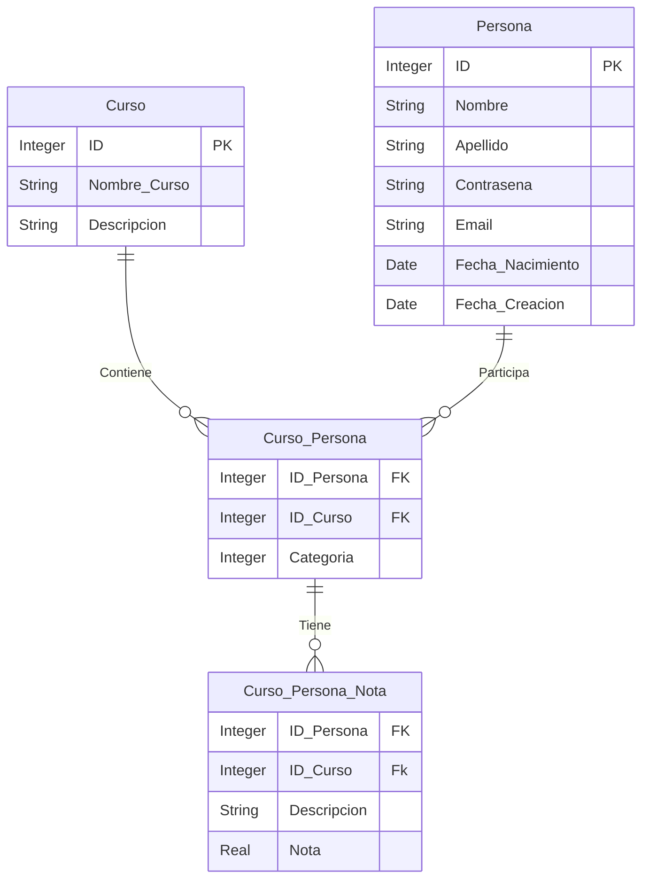

# Pagina Universitaria - Desarollo de Software
[Propuesta](#propuesta)

## Grupo
|Nombre|Legajo|
|:-|:-|
|Oliva, Laureano Ivan|48501|
|Salvía, Camila|49373|
|Zallocco, Emilio|50194|             

## Repositorios
* [FRONT END](https://github.com/camila-salvia/pagina-universitaria-dsw)
* [BACK END](https://github.com/laucha54321/tp-mysql-be)

## Propuesta
### Descripción
  El software desarrollado permitirá que los alumnos de la facultad puedan visualizar en un mismo lugar todo lo necesario de su estado académico, así como por ejemplo, sus notas, cursos en los que está inscripto o exámenes. También permite a los profesores hacer un seguimiento académico de sus alumnos.
### Modelo

### Funciones Principales

* Del alumno

  - Mostrar los cursos en los que está inscripto.
  
  - Inscribirse a un nuevo curso.
  
  - Anotarse a un examen.
  
  - Solicitar una clase de consulta de un curso determinado.
  
  - Permitir a los alumnos ver solamente sus notas.

* Del profesor

  - Cargar las notas de los alumnos.

  - Permitir a los profesores hacer el seguimiento de las notas de cada alumno en el curso a través de una tabla.

  - Subir información sobre el curso, así como apuntes o libros.

  - Agendar una clase de consulta.

  - Añadir una fecha de examen.
  
### Necesidades de Implementación

- Logueo de Usuarios.

- Páginas estáticas de cada curso.

- Página Dinámica que se actualiza segun quien es el usuario.

- Tabla de Notas por curso para seguimiento de las notas por el profesor.
