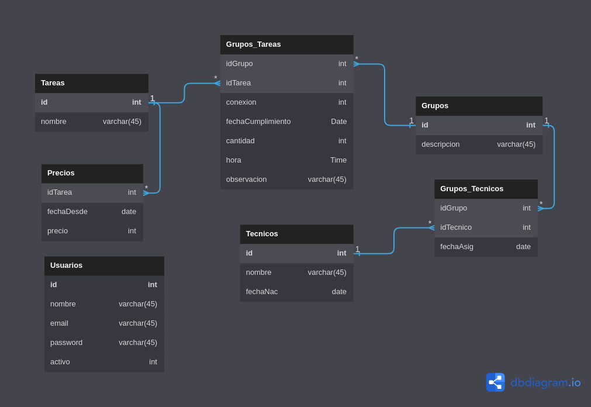

# Propuesta TP DSW

## Grupo
### Integrantes
* 42897 - Gaston Gimenez
* 46749 - Matias Chiodo
* 46247 - Andres Guerrero
* 46310 - Martin Albertengo

### Repositorios
* [Frontend app](https://github.com/gaaston14/TP_CertificacionDeTareas/tree/main/app)
* [Backend app](https://github.com/gaaston14/TP_CertificacionDeTareas/tree/main/api)

## Tema

### Descripción
La empresa SPM tecnologias en instalación, está en busca de un software que le permita llevar adelante la gestión de sus empleados y flota de vehiculos, actualmente se vienen manejando con un archivo de excel, necesitan poder controlar los técnicos, las tareas cumplidas por cada técnico y por cada movil está compuesto de 2 o más técnicos.
A la hora de pagar los sueldos, se parte de un básico por categoria y varía según el horario de cumplimiento de tareas adicionales, ya que se paga un extra por producción. Se desea tener una liquidación mensual por cada técnico.

### Modelo
<html>
  
</html>

## Alcance Funcional 

### Alcance Mínimo

Regularidad:
|Req|Detalle|
| --- | --- |
|CRUD simple|1. CRUD Tecnicos<br>2. CRUD Tareas<br>3. CRUD Grupos|
|CRUD dependiente|1. CRUD Precios {depende de} CRUD Tareas<br>2. CRUD Grupos_Tecnicos {depende de} CRUD Tecnicos|
|Listado<br>+<br>detalle| 1. Listado de Grupos y Tecnicos correspondiendo a qué Grupo pertenece cada Tecnico en un momento dado => detalle CRUD Grupos_Tecnicos<br> 2. Listado de Tareas realizado por un Tecnico, en un momento especifico dando el Precio de dichas Tareas, junto con qué Grupo pertenece => detalle muestra datos completos de cada Tarea realizada por un Tecnico en un período de tiempo
|CUU|1. Registrar nueva Tarea realizada<br>2. Registrar un nuevo Tecnico|

Adicionales para Aprobación
|Req|Detalle|
| --- | --- |
|CRUD |1. CRUD Tareas<br>2. CRUD Grupos_Tareas<br>3. CRUD Grupos<br>4. CRUD Precios<br>5. CRUD Tecnicos<br>6. CRUD Grupos_Tecnicos<br>7. CRUD Usuarios|
|CUU|1. Registrar nueva Tarea realizada<br>2. Registrar un nuevo Tecnico<br>3. Asignar un Tecnico a un Grupo<br>4. Autenticación de Usuarios |

### Alcance Adicional Voluntario

*Nota*: El Alcance Adicional Voluntario es opcional, pero ayuda a que la funcionalidad del sistema esté completa y será considerado en la nota en función de su complejidad y esfuerzo.

|Req|Detalle|
| --- | --- |
|Listados |1. Listar Grupos<br>2. Listar Tecnicos<br>3. Listar Tareas<br>4. Listar Precio de Tareas |
|CUU|1. Registrar nueva Tarea<br>2. Modificar Precio de una Tarea<br>3. Modificar composición de un Grupo<br>4. Alta de nuevo Grupo|
|Otros|1. Mostrar estadísticas en la pantalla inicial de mayor porcentaje de Tareas realizadas y Grupo y/o Tecnico con más Tareas realizadas en el último mes|

## Instalación

1. Clonar el repositorio

```
git clone https://github.com/gaaston14/TP_CertificacionDeTareas.git
```

2. Ejecutar un npm install en cada capa (API y APP)

```
cd api
npm install
cd ../app
npm install
```

3. Configurar variables de entorno

```
api/.env.example <- ejemplo de variables de entorno para el back
app/.env.example <- ejemplo de variables de entorno para el front
```

4. Para levantar en modo desarrollo

```sh
Adentro de /app
npm run dev

Adentro de /api
npm run dev
```
