### Checklist DSW 9/8/24

- [x] Completar los 2 listados con filtro
- [x] Portear la pagina a Mobile-First
- [x] Completar juegos
- [x] Sistema Login-Register
- [x] Perfil del usuario
- [x] Completar las micropaginas
- [x] Mejorar listado estatico
- [x] Completar pagina de error
- [x] Mejorar pagina de juegos
- [x] Completar sidebar
- [x] Email Form

### Checklist DSW 14/9/24
- [x] Error: Cuando se desconecta un usuario la IMG se elimina
- [x] Mejorar Leaderboard Page (CSS, Quitar ID, ?Poner foto de perfil)
- [x] Mejorar Betting History Page (CSS, Menu para volver al profile)
- [x] Dice Funcional
- [ ] Agus: Cuando se mutean los sonidos cambiar Icon
- [x] Bajarle el volumen a los sonidos
- [x] Arreglar detalles Login
- [x] Mejorar Register Page (Agus)
- [x] Cambiar Accepted Currencies & Sponsors

### Checklist DSW 17/10/24
- [X] Hacer responsive Dice y Wheel
- [X] Agregarle Mensaje de error a Login (Agus)
- [ ] Agregar para ingresar plata con mercado pago (AD)
- [ ] Agregar alguna forma de retirar dinero (Simulado, obviamente) (AD)
- [ ] Poder cambiar la password (AD?)
- [X] Terminar Betting history
- [X] Boton para volver atras en el betting history
- [X] ARREGLAR ERRORES TS (Parcialmente solucionado)
- [X] Limpiar la consola 
- [x] ARREGLAR ERROR QUE SALEN 2 COSAS EN LA CONSOLA
- [X] ARREGLAR DETALLES AL DICE
- [X] AGREGAR TIMER AL BOTON DEL DICE
- [X] HACER RUTA DE ACCESOS MIDDLEWARE
- [X] AGREGAR BD EN GOOGLE CLOUD
- [x] TERMINAR DOCUMENTACION
- [X] Hacer responsive el profile
- [x] hacer video
- [X] links pr/mr
- [X] actualizar proposal (hacer diagrama)
- [X] el "Cooming Soon" de la pagina principal desaparece cuando estas en mobile
- [X] Listados responsivos
- [X] Portear HELP a CSS normal
- [X] Arreglar listado de juegos (se rompio al portearlo a CSS normal)
- [x] Utilizar variables globales para los colores
- [x] Portear todo el codigo a ingles
- [x] Arreglar error de ANY en leaderboard.tsx
- [ ] Cuando se recarga la pagina en los listados se bugea
- [x] Organizar carpetas
- [x] Portear todo lo que queda a CSS (Queda header, dice, wheel y headertoogle)
- [ ] Arreglar cuadro de perfil en mobile

### Correcciones AD 6/12/24
- [x] Toda la APP en Ingles
- [x] Sacar todos los SVG y dejarlos como imagenes
- [x] Borrar todos los Console Log
- [x] Agregar Constantes (en Dice: id_game )
- [ ] Funcion para redirijir a la pagina principal
- [x] Nombres de las funciones en minuscula
- [ ] Utilizar CSS en Dice
- [x] Eliminar las cosas que no se utilizan/comentadas
- [x] BalanceModal texto en ingles
- [x] Utilizar parametros para agregar balances
- [x] funcion ScrollToTop como una global""
- [x] Utilizar padding con ShortHand
- [x] Espacio en blanco en el Register
- [x] Utilizar variables para clases en Register
- [x] Eliminar todos los index
- [ ] utilizar rem en vez de px (FALTAN DESDE HEADERMENU)
- [ ] usar variables para colores
- [ ] nombre de las clases css con guion medio
- [x] usar const en vez de let

- [x] La firma del jwtToken deberia estar en un ENV
- [x] El URL de el origen no deberia estar Hardocde en el backend

### Correcciones que no se explicar con palabras
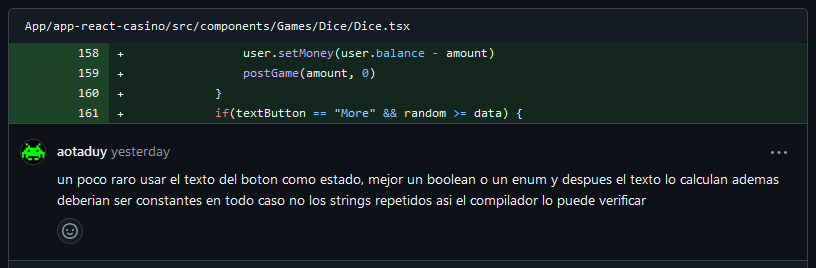
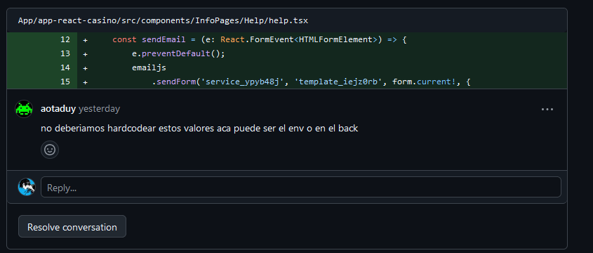
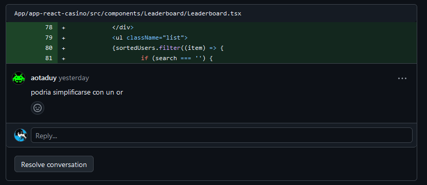
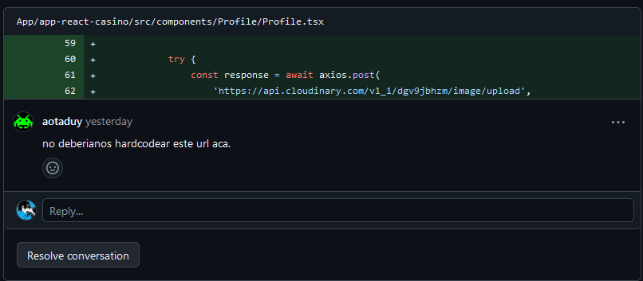
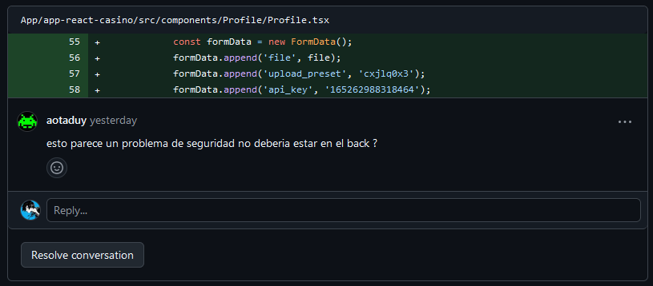
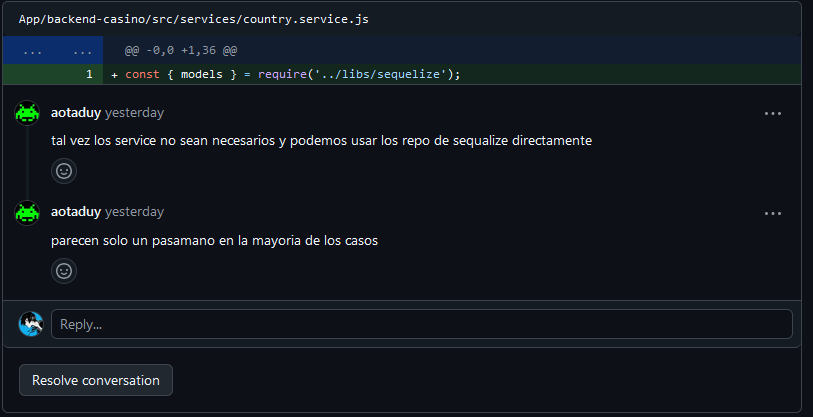
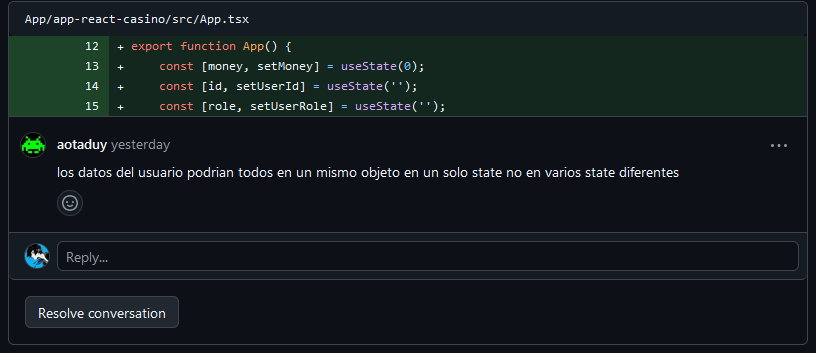
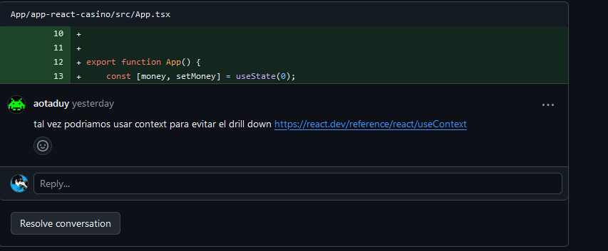
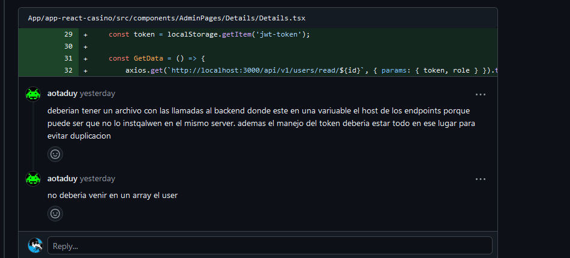
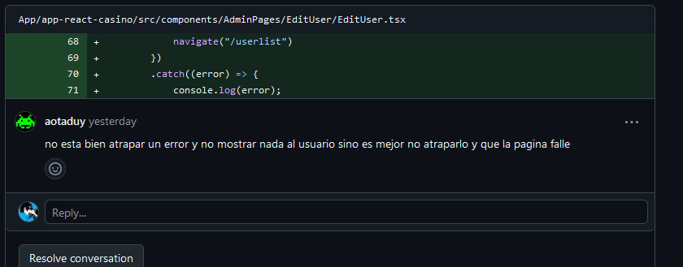
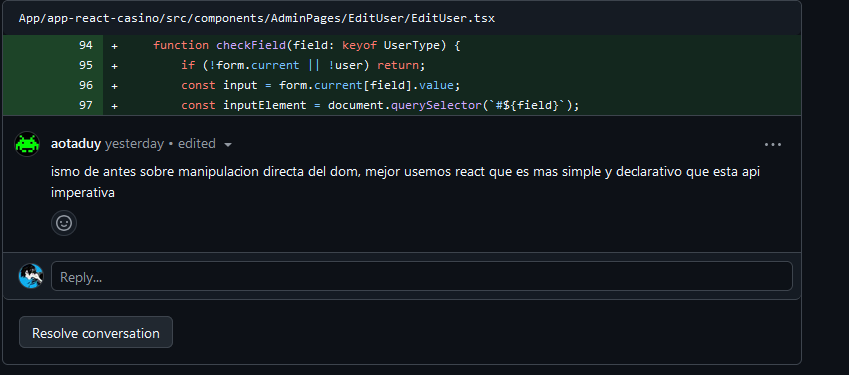
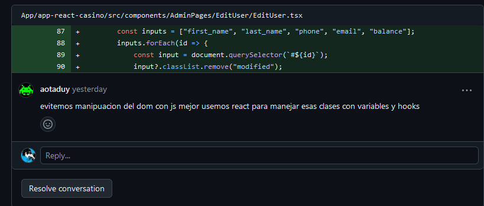