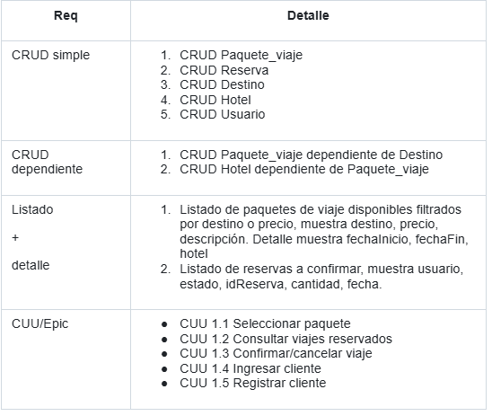

{# Propuesta TP DSW

## Grupo
### Integrantes
* 53477 - Fornells, Nuria Belen
* 52812 - Gerbaudo Milena Luz

### Repositorios
* [frontend app](https://github.com/nuriafornells/frontendTP.git)
* [backend app](https://github.com/nuriafornells/backendTP.git)

## Tema
### Descripción
El proyecto consiste en el desarrollo de una aplicación web full stack para una agencia de viajes. Los usuarios podrán ver distintos paquetes turísticos con destinos nacionales e internacionales, con su precio, fechas de salida/llegada, y detalles de los servicios incluidos,y hacer su reserva junto a las formas de contacto disponibles para realizar la confirmacion o cancelacion de la misma. La app también incluirá funciones para que los administradores puedan gestionar los paquetes y destinos disponibles. 

### Modelo

MD en draw.io: https://drive.google.com/file/d/1fIw_y52k2I7hz1cHX3uEgDLWok7ewhlU/view?usp=sharing

## Alcance funcional
### Alcance minimo

Casos de Uso adicionales o de Mantenimiento
* CUU 2.1 Gestionar paquetes de viajes(hotel, duracion)
* CUU 2.2 Gestionar destinos(destino, paquetes de viaje)

