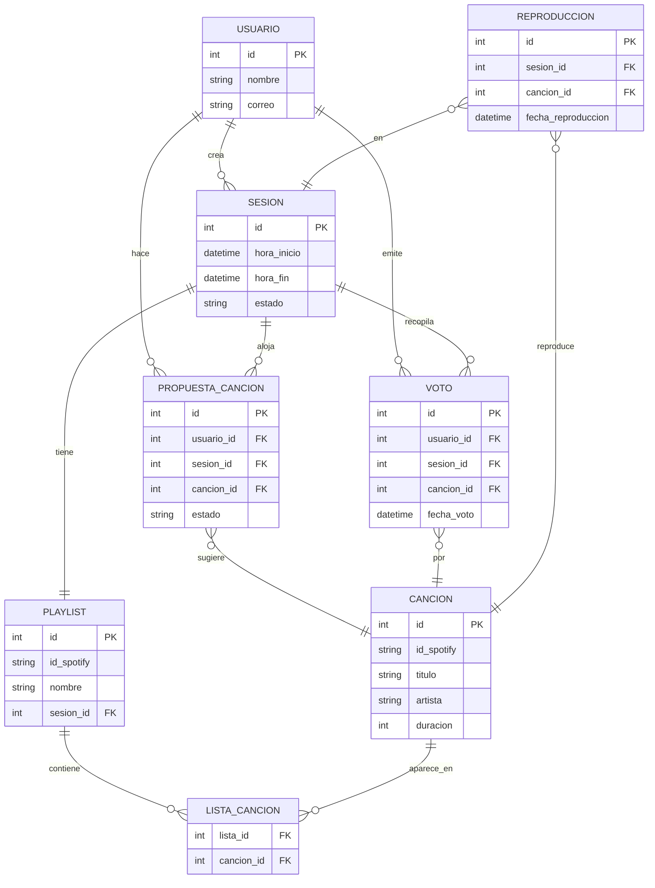

# Propuesta TP DSW

## Grupo
### Integrantes
* 51070 - Rivero, Tomás

### Repositorios
* [frontend app](https://github.com/tmsrivero/front-SDJ)
* [backend app](https://github.com/tmsrivero/back-SDJ)

## Tema
### Descripción
Sistema para reproducir música en bares o espacios públicos donde el público puede votar en tiempo real cuál será el siguiente tema. Las canciones disponibles provienen de una playlist de Spotify y los usuarios pueden también proponer nuevas canciones, que se agregan a dicha lista para futuras votaciones.

### Modelo

## Alcance Funcional 

### Alcance Mínimo

Regularidad:
|Req|Detalle|
|:-|:-|
|CRUD simple|1. CRUD Usuario 2. CRUD Playlist 3. CRUD Canción|
|CRUD dependiente|1. CRUD Voto {depende de} Usuario y Canción 
|Listado + detalle| 1. Listado de canciones con votos actuales => detalle con nombre, artista, duración  2. Listado de historial de canciones|
|CUU/Epic|1. Votar por una canción 2. Reproducir la canción votada|

Adicionales para Aprobación
|Req|Detalle|
|:-|:-|
|CRUD |1. CRUD Usuario 2. CRUD Playlist 3. CRUD Canción 4. CRUD Voto 5. CRUD PropuestaDeCanción 6. Crud Sesión|
|CUU/Epic|1. Crear una sesión 2. Votar por una canción 3. Proponer canción desde Spotify 4. Reproducir automáticamente la canción ganadora en Spotify|

### Alcance Adicional Voluntario
|Req|Detalle|
|:-|:-|
|Listados |1. Ranking de canciones más votadas del día 2. Listado de canciones propuestas con preview|
|CUU/Epic|1. Rechazar una propuesta de canción (administrador)|
|Otros|1. Integración con Spotify: agregar automáticamente propuestas aprobadas a la playlist real 2. Reproducción automática del tema con más votos usando el reproductor web de Spotify|

