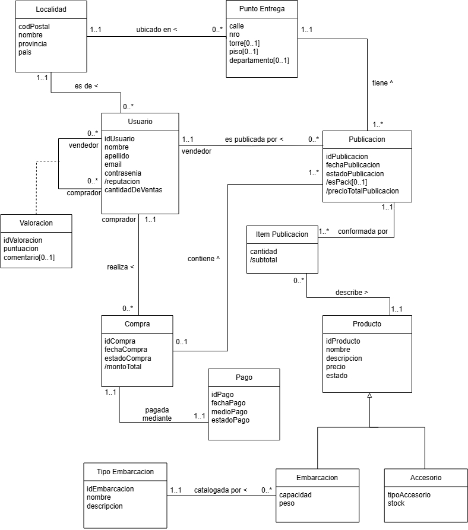

# Propuesta TP DSW

## Grupo
### Integrantes
* 52077 – Boveri, Rafaela
* 52280 – Cardelli, Lázaro
* 50258 – Martina, Santiago
* 51191 – Mateo, Alexis

### Repositorios
* [frontend app](https://github.com/AlexisMateo02/tp_frontend_dsw)
* [backend app](https://github.com/AlexisMateo02/tp_backend_dsw)

## Tema
### Descripción
*El sistema a desarrollar será una plataforma web enfocada a la compra y venta de embarcaciones de río, así como también de diferentes accesorios náuticos.
El sistema contará con dos roles principales: vendedores y compradores.
Los compradores podrán explorar el catálogo, consultar los perfiles de los vendedores, comparar sus productos de interés y concretar compras directamente desde el sistema, sin necesidad de contacto o intermediación con el vendedor, realizando los pagos directamente desde la página y retirando el/los producto/s en un punto de retiro especificado por el vendedor.
Los vendedores podrán publicar embarcaciones y accesorios para la venta de las mismas, actualizar precios, y gestionar pedidos y/o disponibilidad.*

### Modelo

## Alcance Funcional 

### Alcance Mínimo

Regularidad
|Req|Detalle|
|:-|:-|
|CRUD simple|1. CRUD Usuario 2. CRUD Compra 3. CRUD Publicacion 4. CRUD Localidad|
|CRUD dependiente|1. CRUD Valoracion {depende de} CRUD Usuario 2. CRUD Punto Entrega {depende de} CRUD Publicacion/ CRUD Localidad|
|Listado + detalle| 1. Listado de compras filtrado por un usuario (comprador) y un rango de fechas de compra, muestra monto total y estado de la compra => detalle CRUD Compra  2. Listado de publicaciones filtrado por rango de precios y por si es un pack o no, muestra fecha, estado y precio de la publicación => detalle muestra datos completos de la publicación, del punto de entrega y del usuario (vendedor)|
|CUU/Epic|1. Realizar la publicación de una venta 2. Valorar a otro usuario como vendedor|

Adicionales para Aprobación
|Req|Detalle|
|:-|:-|
|CRUD |1. CRUD Usuario 2. CRUD Compra 3. CRUD Publicacion 4. CRUD Localidad 5. CRUD Valoracion 6. CRUD Punto Entrega 7. CRUD Item Publicacion 8. CRUD Producto 9. CRUD Articulo 10. CRUD Embarcacion 11. CRUD Tipo Embarcacion 12. Pago|
|CUU/Epic|1. Publicar una oferta de venta de un producto o pack 2. Realizar la compra de una publicación 3. Realizar el pago de una compra 4. Valorar al vendedor tras la compra|

### Alcance Adicional Voluntario

|Req|Detalle|
|:-|:-|
|Listados |1. Listado de usuarios con mejor reputación filtrado por provincia o localidad, mostrando cantidad de ventas y puntaje promedio 2. Listado de productos más vendidos (por cantidad en líneas de compra), con opción de filtrar por rango de fechas|
|CUU/Epic|1. Realizar el pago de una compra mediante cuotas 2. Cancelar una de compra|
|Otros|1. Envío de notificación por email al vendedor cuando un usuario realiza una compra|