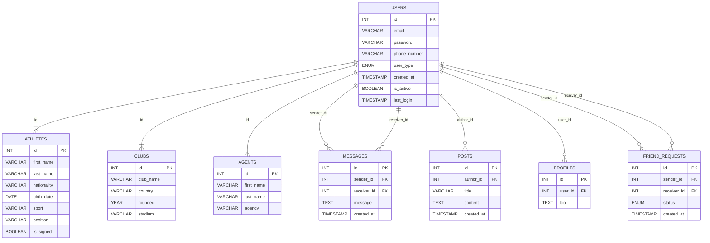

# Propuesta TP DSW

## Grupo
### Integrantes
* 51754 - Mondelli, Lucio
* 51497 - Plenza, Liam
* 51543 - Wardoloff,Tomás 

### Repositorios
* [frontend app](https://github.com/Tomas-Wardoloff/TP_DSW_FrontEnd)
* [backend app](https://github.com/Tomas-Wardoloff/TP_DSW_BackEnd)

## Tema
### Descripción
Nuestro proyecto consiste en una aplicación web enfocada en dar visibilidad a jugadores de diferentes deportes a nivel a amateur y a los reclutadores y clubes la posibilidad de adquirir nuevos refuerzos. Ofreciendo un entorno similar a LinkedIn pero abocado al deporte, nuestra plataforma fomenta las conexiones entre atletas y oportunidades de crecimiento en sus respectivos campos.

### Modelo

## Alcance Funcional 

### Alcance Mínimo

Regularidad:
|Req|Detalle|
|:-|:-|
|CRUD simple|1. CRUD User 2. CRUD Agente 3. CRUD Club|
|CRUD dependiente|1. CRUD Publicacion {depende de} CRUD User 2. CRUD Atleta {depende de} CRUD User|
|Listado + detalle| 1. Listado de Clubes filtrado por nombre, muestra perfil del club => detalle CRUD Club  2. Listado de Atletas filtrado por deporte, categoria, posicion, estado => muestra perfiles de atletas que coincidan con la busqueda|
|CUU/Epic|1. Realizar una solicitud de amistad 2. Realizar una publicación|

Adicionales para Aprobación:
|Req|Detalle|
|:-|:-|
|CRUD |1. CRUD Atleta 2. CRUD Agente 3. CRUD Club 4. CRUD Estadisticas 5. CRUD Publicación 6. CRUD Solicitud 7. CRUD Mensaje|
|CUU/Epic|1. Realizar una publicación 2. Mandar una solicitud de conexión 3. Realizar una convecatoria a un evento|

### Alcance Adicional Voluntario

|Req|Detalle|
|:-|:-|
|Listados |1. Listado de convocatorias filtrado por Club  2. Listado de publicaciones filtrado por Deporte|
|CUU/Epic|1. Inscribirse a una convocatoria 2. Republicar una publicación de otro usuario|
|Otros|1. Envio de recordatorio y confirmación de inscripción a una convocatoria via mail|

