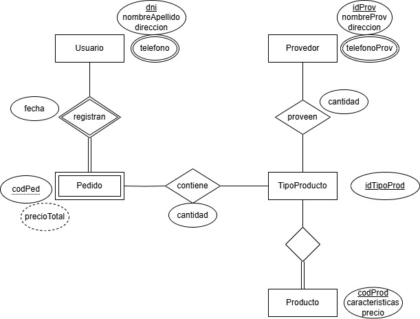

# Propuesta TP DSW

## Grupo
### Integrantes
* 48881 - Calderon, Bruno
* 48009 - Bilicich, Matias
* 47433 - Lardizábal, Tomás

### Repositorios
* [fullstack app](https://github.com/Calhdo/tp-dsw-2025.git)

## Tema
### Descripción
El sistema de gestión de inventarios permitirá a un local de informática llevar un control de sus productos, registrar ingresos, egresos y niveles de stock. Además, incluirá una funcionalidad que permitirá la emisión de un listado filtrando por tipo de producto, disponibilidad, marca. Asimismo el usuario podrá registrar nuevos pedidos, cancelar pedidos ya realizados y ver un historial de los mismos.

### Modelo

## Alcance Funcional 
|Req|Detalle|
|:-|:-|
|CRUD simple|1. CRUD Tipo Producto 2. CRUD Usuario 3. CRUD Provedor|
|CRUD dependiente|1. CRUD Producto {depende de} CRUD Tipo Producto 2. CRUD Pedido {depende de} CRUD Usuario|
|Listado + detalle| 1. Listado de productos filtrado por tipo de producto, marca y stock  2. Historial de pedidos registrados filtrado por fecha, estado del pedido y nombre del cliente => detalle muestra en detalle los preductos pedidos|
|CUU|1. Notificar de la existencia de un producto al usuario 2. Verificar la disponibilidad de un producto|

