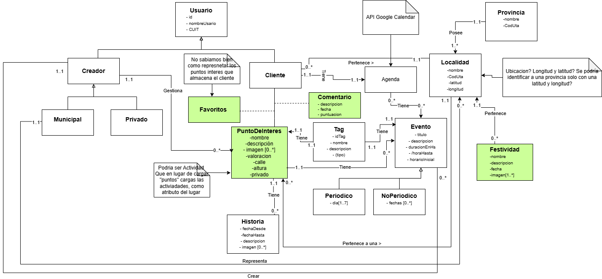

# Propuesta TP DSW

## Grupo
### Integrantes
* 52805 - Laveggi, Valentino (Comisión 303)
* 53402 - Murúa, Joaquín Tomás (Comisión 303)
* 52937 - Romero, Gabriel Tobías (Comisión 304)

### Repositorios
* [frontend app](https://github.com/Evenaut7/TP_DSW_FrontendApp.git)
* [backend app](https://github.com/Evenaut7/TP_DSW_BackendApp.git)

## Tema
### Descripción
El sistema propuesto es una plataforma web que permite a los usuarios descubrir puntos de interés, actividades y eventos disponibles en distintas localidades, priorizando experiencias significativas, inclusivas y con propósito social. 

### Modelo

* [Draw.io](https://drive.google.com/file/d/1lk8nXVs_xaIrwI9erYk_CGOQRLd_-vMT/view?usp=sharing)

## Alcance Funcional 

### Alcance Mínimo
Regularidad:
|Req|Detalle|
|:-|:-|
|CRUD simple|1. CRUD Localidad  2. CRUD Tag 
|CRUD dependiente|1. CRUD Usuario {depende de} CRUD ?  2. CRUD PuntoInteres{depende de} CRUD Localidad   3. CRUD Evento {depende de} CRUD PuntoInteres|
|Listado + detalle| 1. Listado de Evento  => Detalle muestra nombre del evento, una imagen de la actividad, tipo de evento, fecha más próxima y horario. 2. Listado de Puntos de interés => Detalle muestra una imagen del punto de interés, nombre, y breve descripción|
|CUU/Epic|1. Evento (crear + notificación) 2. Valoración|

Adicionales para Aprobación:
|Req|Detalle|
|:-|:-|
|CRUD |1. CRUD Festividad  2. CRUD Historia 3. CRUD Provincia 4. CRUD Localidad 5. CRUD Tag 6. CRUD Cliente 7. CRUD Creador  8. CRUD Evento 9. CRUD Comentario 10. CRUD Municipal 11. CRUD Privado 12. CRUD Favorito 13. CRUD Agenda 14. CRUD PuntoDeInteres|
|CUU/Epic|1.Realizar un comentario sobre un punto de interés.  2. Guardar un evento en la agenda. 3. Guardar un punto de interés en favoritos.|

### Alcance Adicional Voluntario

*Nota*: (A definir)
