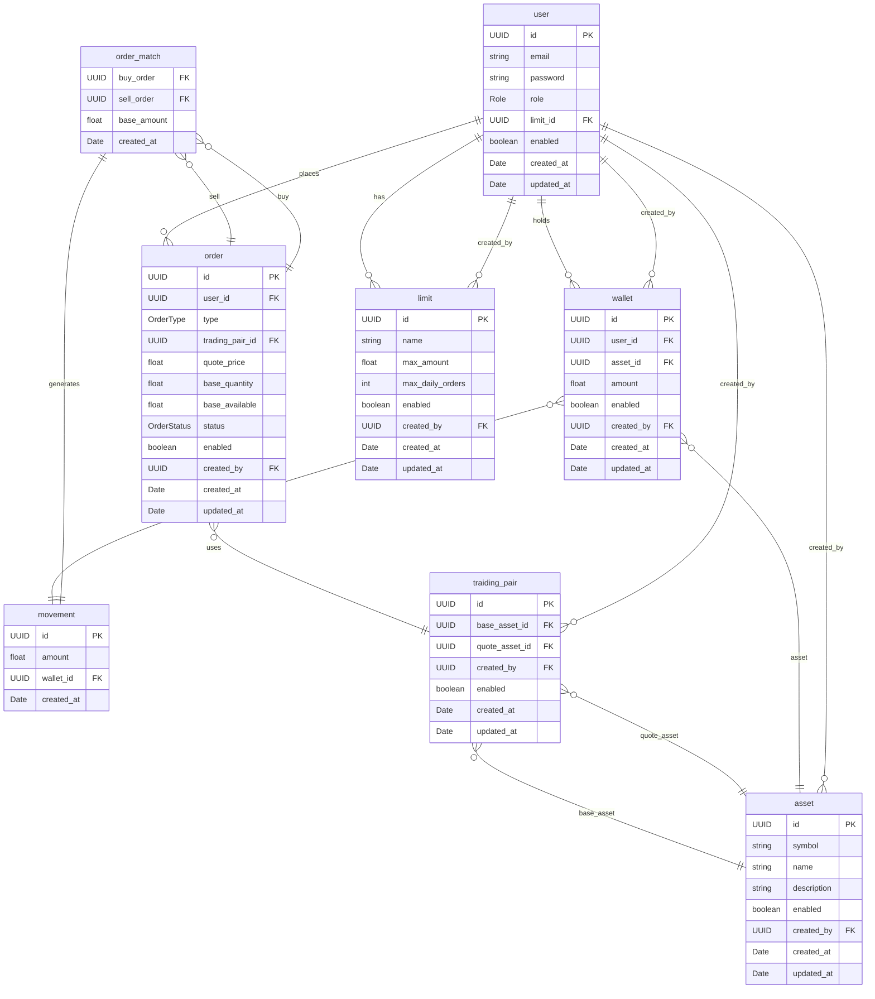

# Propuesta TP DSW

## Grupo
### Integrantes
* 44987 - Cabanellas, Ignacio
* 45091 - Cordoba, Lucas
* 45090 - Nicola, Francisco

### Repositorios
* [fullstack app] (https://github.com/IgnacioCabanellas/trading-platform)

## Tema
### Descripción

El sistema propuesto consiste en una plataforma web destinada al manejo de operaciones de compra y venta de activos financieros, simulando el funcionamiento de un order book. El usuario final podrá colocar órdenes de compraventa y ver el historial de sus operaciones a traves de los distintos activos que se ofrecen.

### Modelo

## Alcance Funcional 

### Alcance Mínimo

#### Regularidad
|Req|Detalle|
|:-|:-|
|CRUD simple|1. CRUD Activos 2. CRUD Límites 3.|
|CRUD dependiente|1. CRUD Usuarios 2. CRUD Traiding Pairs |
|Listado + detalle|1. Listado de ordenes vigentes de una paridad → Muestra tipo, precio, cantidad → Detalla muestra la orden completa y su activo asociado  2. Listado de activos → Filtrable parcial por nombre → Muestra nombre y símbolo → Detalla nombre, descripción, fecha de alta|
|CUU/Epic|1. Ingresar activos a la cuenta   2. Colocar una orden de compra o venta|

#### Adicionales para Aprobación
|Req|Detalle|
|:-|:-|
|CUU/Epic|1. Cancelar ordenes pendientes|

### Alcance Adicional Voluntario

|Req|Detalle|
|:-|:-|
|Listados |1. Historial de movimientos del usuario   → Ordenado por fecha filtrable por activo   → Muestra ingreso y egreso de activos → Detalla fecha   2. Listado de saldos por usuario   → Muestra activo, saldo disponible y bloqueado   → Detalle permite ver historial de movimientos|
|CUU/Epic|1. Generar un reporte donde se detallen las operaciones|
