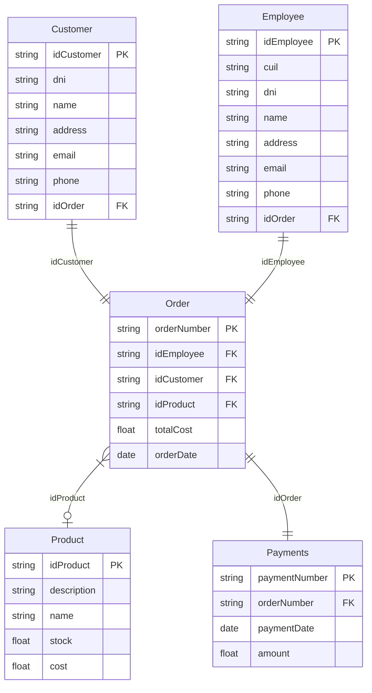

# Propuesta TP DSW

# Grupo
### Integrantes
* 49704 - Boggio Valentino
* 50025 - Larrauri Martina
* 49640 - Leali Bruno
* 48840 - Zapata Nicolas

### Repositorios
* frontend app [in progress..]
* [backend app](https://github.com/valentttino/backend-tp-dsw-2024)
## Tema
### Descripción
Se realizará un sitio para poder llevar a cabo una gestión de clientes, sus pedidos y sus pagos. A su vez, se podrá acceder a la información de los materiales y balances de pago.
### Modelo

*Se analizará crear nuevas clases y/o atributos según se vea conveniente.*
## Alcance Funcional
### Alcance Mínimo
***Regularidad***
| Req | Detalle |
|--|--|
| CRUD simple | CRUD Customer   CRUD Order   CRUD Product   CRUD Employee |
|CRUD dependiente|CRUD Product_Cost   CRUD Payments |
|Listado + detalle|1. Listado de productos.   2. Listado de pedidos.|
|CUU/Epic|1. Registrar un cliente.   2. Registrar un pedido para un cliente determinado.|

***Aprobación***
| Req | Detalle |
|--|--|
| CRUD simple | CRUD Customer   CRUD Order   CRUD Product   CRUD Employee |
|CRUD dependiente|CRUD Product_Cost   CRUD Payments |
|Listado + detalle|1. Listado de productos.   2. Listado de pedidos.|
|CUU/Epic|1. Registrar un cliente.   2. Registrar un pedido para un cliente determinado.   3. Registrar el modo de pago del pedido.   4. Actualizar stock o precio de los productos. |

