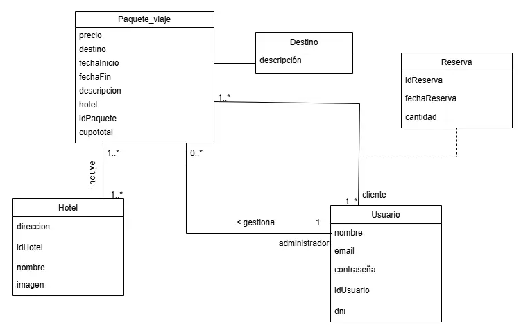

{# Propuesta TP DSW

## Grupo
### Integrantes
* 53477 - Fornells, Nuria Belen
* 52812 - Gerbaudo Milena Luz

### Repositorios
* [frontend app](https://github.com/nuriafornells/frontendTP.git)
* [backend app](https://github.com/nuriafornells/backendTP.git)

## Tema
### Descripción
El proyecto consiste en el desarrollo de una aplicación web full stack para una agencia de viajes. Los usuarios podrán ver distintos paquetes turísticos con destinos nacionales e internacionales, con su precio, fechas de salida/llegada, y detalles de los servicios incluidos,y hacer su reserva junto a las formas de contacto disponibles para realizar la confirmacion o cancelacion de la misma. La app también incluirá funciones para que los administradores puedan gestionar los paquetes y destinos disponibles. 

### Modelo

MD en draw.io: https://drive.google.com/file/d/1fIw_y52k2I7hz1cHX3uEgDLWok7ewhlU/view?usp=sharing

## Alcance funcional
### Alcance minimo
# regularidad
| req | Detalles |
|:-|:-|
|CRUD simple| 1. CRUD hotel   2. CRUD destino|
|CRUD dependiente|CRUD paquete_viaje {depende de} CRUD destino|
|Listado + detalle| 1. Listado de paquetes de viaje disponibles filtrados por destino, muestra destino, precio, descripcion.Detalle muestra fechaInicio, fechaFin y hotel.|
|CUU/Epic|1. Hacer reserva|

# aprobacion:
| req | Detalles |
|:-|:-|
|CRUD |1. CRUD usuario   2. CRUD destino   3. CRUD paquete_viaje   4. CRUD hotel|
|Listado + detalle| 1. Listado de paquetes de viaje disponibles filtrados por destino, muestra destino, precio, descripcion.Detalle muestra fechaInicio, fechaFin y hotel.   2. Listado de reservas a confirmar, muestra datos usuario, estado de reserva,idReserva, cantidad y fecha|
|CUU/Epic| 1. Hacer reserva   2. Confirmar o cancelar reserva   3. Hacer reseña|

