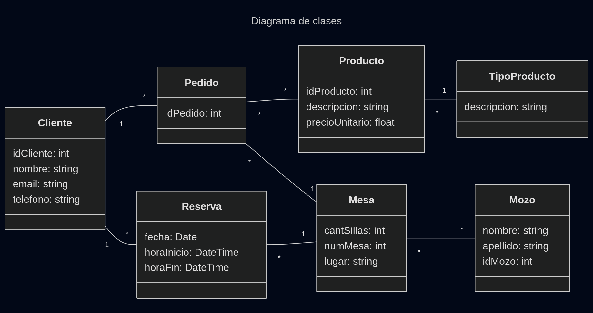

# Propuesta TP DSW

## Grupo
### Integrantes
* 45198 - Romo, Matías
*  - Heidel, Alan
* 2 - b

### Repositorios
* [frontend app](https://github.com/matiusuario/utnfrrodsw-frontend)
* [backend app](https://github.com/matiusuario/utnfrrodsw-backend)

## Tema
### Descripción
Se trata del sistema para gestionar los pedidos en un bar o restaurante. Los clientes al sentarse en una mesa pueden ingresar y hacer un pedido que será visualizado por un administrador, eventualmente aceptado y posteriormente servido por un mozo. Adicionalmente se permitirá realizar reservas de las mesas por parte de los clientes.

### Modelo

[](https://mermaid.live/edit#pako:eNp9VF1vmzAU_SvoPk4QBQgk5bVTpUqrNHXdy8SLi2_I1YyNjJm2RvnvM5gk4Db10_U598vH1z5CpThCAVEUldKQEVgEX4nVmjUs4BhUgnXYlXLkh003saXkpLEypGTw7bmUgV0jH9wLQmkwODpwWMQnsAhImisuVfOqLdgZTbK-4tgwEu9hgwL3Sqolc5oX_46cuFrWdtis9CLiGTvUf9g8ZI_VgVkdmMEreFCaPUqqSDnmhRqPfSDpU8vetOJ9ZfzuJtSThmNXaWptOfleiNYqT-qnJMP00M9eKPbR2Z6wWxysYtL8IGE5_yL6ZvD1UNHXTH8i9gu16qND3ex92Zx6W0TdGgbWohDjBfoM8SGH1_SlkjPO01hCXEIQRdb4Yg03E5-6TIPhfM5T4qjRZ3AeRHMOo9QzdjCG7hw7jaXHn7WbfM5KejXmKt_Kdu0FQqg1cSj2THQYQoPaPia7h1HqEswB7XRCYU3O9O8SSnmyQS2Tv5RqoDC6t2Fa9fXhkqRvuR3r6eVfXFBy1PeqlwaKNB5TQHGEv1AkebLapHd5mifpepPvtlkI_6DI4lWcbu0236XxOttsTyG8jUXXq10cx8kmy5N1nN1lu20I9pBG6Sf3P43f1Ok_gKBmgA)

## Alcance Funcional

### Alcance Mínimo

Regularidad:

|Req|Detalle|
|:-|:-|
|CRUD simple|1. CRUD Cliente 2. CRUD Mesa 3. CRUD Mozo|
|CRUD dependiente|1. CRUD Pedido {depende de} CRUD Cliente 2. CRUD Reserva {depende de} CRUD Mesa y Cliente|
|Listado + detalle| 1. Listado de mesas filtrado por estado, muestra nro de sillas y estado de ocupación => detalle CRUD Mesa  2. Listado de pedidos filtrado por mesa y tipo de producto, muestra estado, nombre y tipo de producto => detalle muestra datos completos de los productos y de la mesa|
|CUU/Epic|1. Reservar una mesa del bar 2. Realizar un pedido|

Adicionales para Aprobación:

|Req|Detalle|
|:-|:-|
|CRUD |1. CRUD Cliente 2. CRUD Mesa 3. CRUD Mozo 4. CRUD Tipo Producto 5. CRUD Producto 6. CRUD Reserva 7. CRUD Pedido|
|CUU/Epic|1. Reservar una mesa del bar 2. Realizar un pedido 3. Realizar el pago de uno o más pedidos|

### Alcance Adicional Voluntario

|Req|Detalle|
|:-|:-|
|Listados |1. Pedidos filtrados por Tipo Producto y Cliente, muestra el estado y el nombre de los productos y sus tipos 2. Reservas filtradas por fecha muestra datos de la mesa, la fecha y el nombre del cliente|
|CUU/Epic|1. Solicitar mozo 2. Cancelar reserva|
|Otros|1. Envío de recordatorio de reserva por email|

