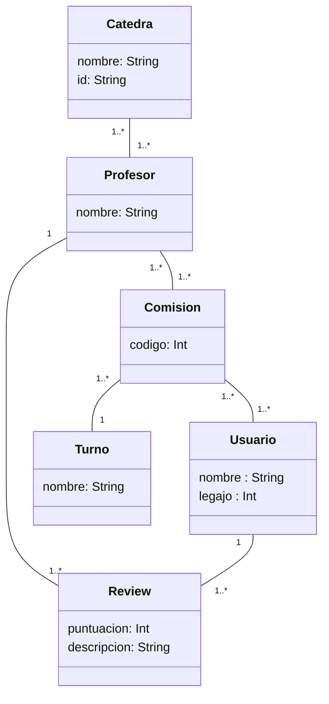

# TP-DSW-2024
# Propuesta TP DSW

## Grupo
### Integrantes
* 50979 - María Clara Genovese
* 50977 - Pennice Lucas Agustin
* 50235 - Bruno Pacienzia

### Repositorios
* [frontend app](https://github.com/LucasPennice/TP-DSW-FRONT.git)
* [backend app](https://github.com/LucasPennice/TP-DSW-BACK.git)

## Tema
### Descripción
Servicio para calificar la experiencia con el docente en distintas asignaturas de la carrera de sistemas de la UTN Rosario. Ademas se permite la lectura de estas calificaciones a cualquier alumno inclusive sin estar registrado, para ayudarlo a tomar una mejor decision a la hora de inscribirse a las asignaturas de la carrera

### Modelo

## Alcance Funcional 

### Alcance Mínimo

Regularidad:
|Req|Detalle|
|:-|:-|
|CRUD simple|1. CRUD Catedra 2. CRUD Usuario Administrador 3. CRUD Usuario|
|CRUD dependiente|1. CRUD Review {depende de} CRUD Catedra  2. CRUD Profesor {depende de} CRUD Catedra y CRUD Turno|
|Listado + detalle| 1. Listado de reviews filtrado por profesor, muestra calificacion y comentario => detalle de la review  2. Listado de catedras filtrado por nombre de catedra y turno, muestra nombre profesor, profesor mejor calificado, calificacion promedio de profesor de la catedra  => detalle de la catedra|
|CUU/Epic|1. Escribir una review 2. Dar de alta un profesor|

Adicionales para Aprobación
|Req|Detalle|
|:-|:-|
|CRUD |1. CRUD Catedra 2. CRUD Usuario Administrador 3. CRUD Usuario 4. CRUD Turno 5. CRUD Review 6. CRUD Profesor 7. CRUD Comision|
|CUU/Epic|1. Escribir una review 2. Dar de alta un profesor 3. Dar de alta una catedra  4. Consultar reviews de un profesor/catedra|

### Alcance Adicional Voluntario

*Nota*: El Alcance Adicional Voluntario es opcional, pero ayuda a que la funcionalidad del sistema esté completa y será considerado en la nota en función de su complejidad y esfuerzo.

|Req|Detalle|
|:-|:-|
|Listados |1. Listado de todas las reviews ordenas/filtradas basandose en la calificacion (positivas - negativas)|
|CUU/Epic|1. Eliminar reviews que contengan malas palabras  2. Solicitar aprobacion de una review por un moderador  3. Registrarse como nuevo usuario|
|Otros|1. Verificar reviews automaticamente antes de enviarlas a un moderador   2. Comprobar que el alumno pertenezca a la institucion   3. Comprobar que el alumno haya cursado la materia de la que escribe la review |

