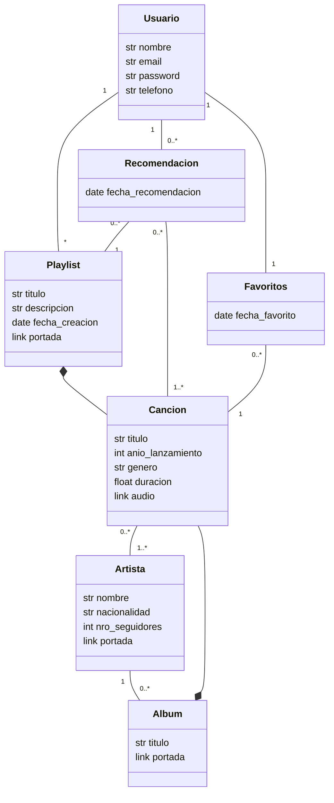

# Propuesta TP DSW

## Grupo
### Integrantes
* 47999 - Paolini, Alessandro
* 47844 - Vivas, Facundo Ignacio
* 47800 - Guerra, Bautista

### Repositorios
* [fullstack app](https://github.com/AlessandroPaolini7/TTADS-2023.git)

## Aplicación de streaming de música
### Descripción
El negocio de esta aplicación de streaming de música se centra en ofrecer a los usuarios una plataforma para descubrir, reproducir y gestionar música de forma conveniente y personalizada. La aplicación permite a los usuarios registrarse y acceder a una amplia biblioteca de canciones de diversos géneros y artistas. Los usuarios pueden crear y administrar listas de reproducción personalizadas, así como explorar recomendaciones basadas en su lista de favoritos.

### Modelo

## Alcance Funcional 

### Regularidad:
|Req|Detalle|
|:-|:-|
|CRUD simple|1. CRUD Usuario 2. CRUD Artista |
|CRUD dependiente|1. CRUD Playlist 2. CRUD Cancion 3. CRUD Album |
|Listado + detalle| 1. Listado de Canciones filtradas por título, género y artista => detalle completo de la canción  2. Listado de playlists filtradas por aquellas creadas por el usuario => detalle completo de la playlist + detalle canciones|
|CUU/Epic|1. Crear una nueva playlist 2. Agregar una canción a playlist existente|

### Aprobación:
|Req|Detalle|
|:-|:-|
|CRUD |1. CRUD Usuario 2. CRUD Playlist 3. CRUD Cancion 4. CRUD Artista 5. CRUD Album 6. CRUD Favoritos 7. CRUD Recomendacion|
|CUU/Epic|1. Modificar la lista de favoritos 2. Realizar una recomendación basada en la lista de favoritos del usuario|

### Alcance Adicional Voluntario:
|Req|Detalle|
|:-|:-|
|Listados | Listado de las 10 canciones más similares a los favoritos del usuario |
|CUU/Epic| 1. Implementar perfiles de usuario 2. Restringir las acciones según los perfiles de usuario |
