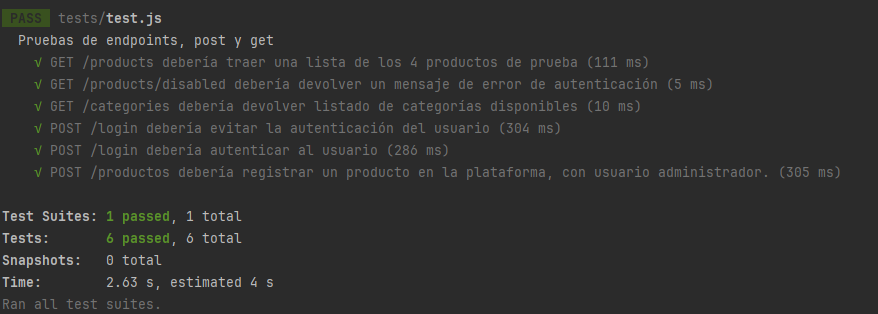
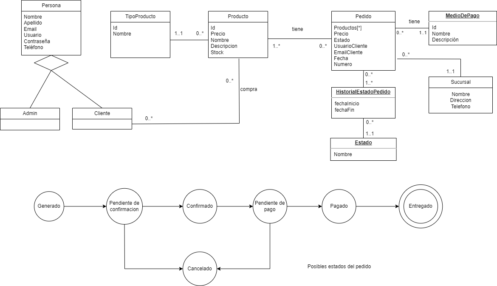

# Propuesta TP DSW

## Grupo
### Integrantes

* 47867 - Martínez Gaspar Andrés
* 51330 - Bidart Salomon Franco Hector Pablo

### Repositorios
* [Repositorio FRONTEND](https://github.com/francobidart/dsw-tp-frontend)
* [Repositorio BACKEND](https://github.com/francobidart/dsw-tp-backend)

### Instrucciones de instalación
* [Intrucciones Frontend](https://github.com/francobidart/dsw-tp-frontend/blob/main/docs/README.md)
* [Instrucciones Backend](https://github.com/francobidart/dsw-tp-backend/blob/main/docs/README.md)

### Histórico de commits
* [Histórico Frontend](https://github.com/francobidart/dsw-tp-frontend/commits/main)
* [Histórico Backend](https://github.com/francobidart/dsw-tp-backend/commits/main)

### Board de Trello con tareas asignadas y track de features

* [Board trello](https://trello.com/invite/b/zwhwWKR1/ATTIebd2f5bd2e2ca994f68ff653280ea0aa6B0E8CD7/plataforma-dsw)

### Documentación de API

Utilizamos Swagger UI para la documentación de la API de la aplicación, se ejecuta junto con el backend en la ruta **/api-docs**

Más información en https://github.com/francobidart/dsw-tp-backend/blob/main/docs/README.md

### Evidencia de la ejecución de test automáticos

Backend:

Para más información sobre cómo ejecutar los tests de backend consulte https://github.com/francobidart/dsw-tp-backend/blob/main/docs/README.md

### Demo de app en video

TODO

---

## Tema
### Descripción

Desarrollaremos una plataforma de e-commerce acotada, que permitirá realizar la venta de artículos de informática. 
Contemplará el flujo de compra completo, así como la registración de artículos y pedidos. Contará con una gestión de usuarios, que
tendrán diferentes tipos de acceso de acuerdo al nivel asociado a ellos.

### Modelo

Link: [Modelo](https://drive.google.com/file/d/1pel8NPW2CEdsYUWWS26cUfVe_WRnkMDX/view?usp=sharing)

## Alcance Funcional 

La funcionalidad de la plataforma está completa, es posible realizar todas las acciones desde la API REST o bien desde el frontend, donde se proveen todos los componentes necesarios para la ejecución de los casos de uso.

Aprobación Directa:

|Req| Detalle                                                                                                                                                                                                                  |
|:-|:-------------------------------------------------------------------------------------------------------------------------------------------------------------------------------------------------------------------------|
|CRUD simple| 1. CRUD Producto  2. CRUD Usuario 3. CRUD Medio de Pago 4. CRUD Sucursal 5. CRUD Categorías                                                                                                               |
|CRUD dependiente| 1. CRUD Producto {depende de} CRUD Categorías.                                                                                                                                                                        |
|Listado + detalle| 1. Listado de producto filtrado por nombre y por precio, mostrando los datos del producto.  2. Listado de pedido por usuario, mostrando numero de pedido, nombre de cliente, nombre de sucursal e importe del pedido. |
|CUU/Epic| 1. Realizar pedido. 2. Marcar pedido como entregado. 3. Marcar pedido como cancelado y restaurar stock.                                                                                                            |

