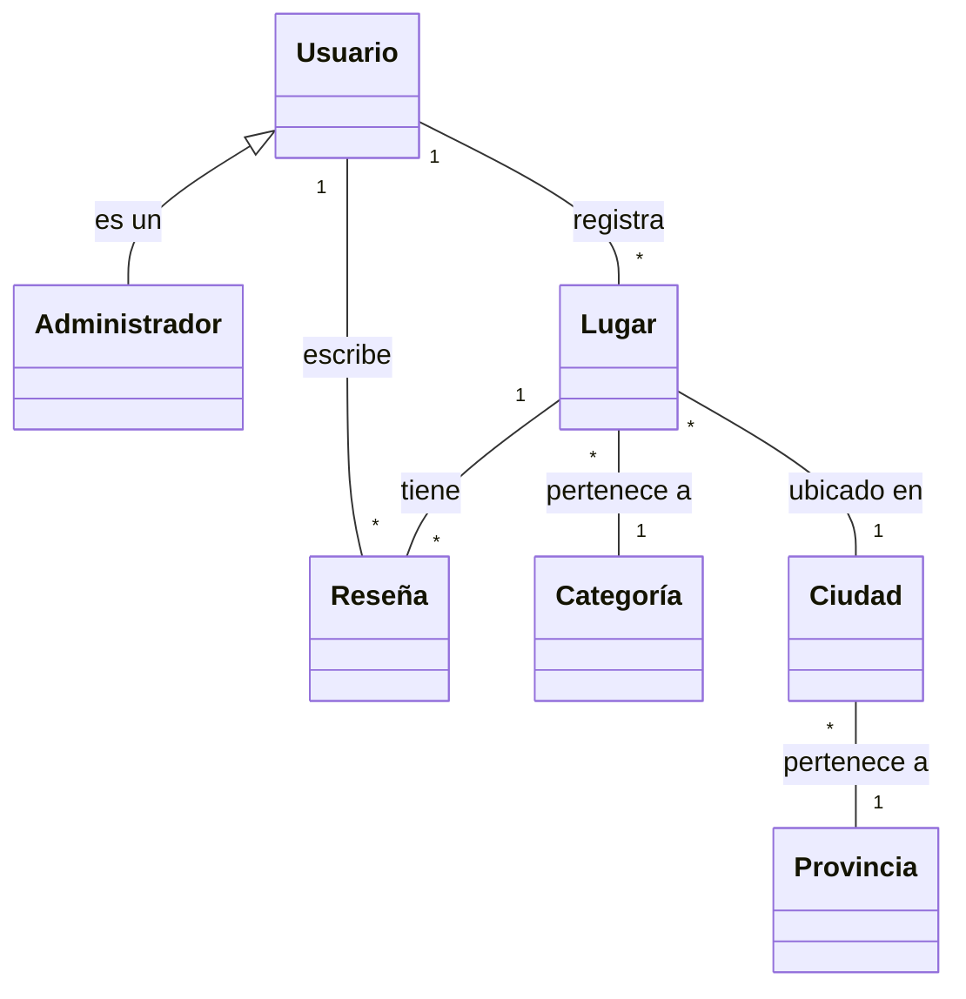

# desarrollo-de-software
TP Desarrollo de Software
# Propuesta TP DSW - Buscador de Locales

## Grupo
**Integrantes:**
- [39233] - Rohr, Claudio
- [46216] - Navarro Betti, Francisco
- [52243] - Paz Alvarez, José

## Repositorios

## Tema
**Buscador de Locales: Plataforma de descubrimiento locales dentro de tu ciudad**

## Descripción
Buscador de locales es una aplicación que permite a usuarios descubrir y compartir lugares de interés en su localidad. Los usuarios pueden explorar restaurantes, tiendas, etc. organizados por categorías, además de contribuir con reseñas y recomendaciones propias. El sistema distingue entre usuarios normales y administradores.

## Modelo

## Alcance Funcional

### Alcance Mínimo (Regularidad)

| Req | Detalle |
|-----|---------|
| CRUD simple | 1. CRUD Categoría (Administrador) 2. CRUD Provincia (Administrador) 3. CRUD Ciudad (Administrador) |
| CRUD dependiente | 1. CRUD Lugar {depende de} CRUD Categoría y CRUD Ciudad 2. CRUD Reseña {depende de} CRUD Usuario y CRUD Lugar |
| Listado + detalle | 1. Listado de lugares filtrado por categoría, muestra nombre, dirección y calificación promedio => detalle muestra información completa del lugar 2. Listado de reseñas filtrado por lugar, muestra calificación, fecha y nombre de usuario => detalle muestra contenido completo de la reseña y datos del usuario |
| CUU/Epic | 1. Buscar lugares cercanos por geolocalización 2. Publicar reseña de un lugar visitado |

### Adicionales para Aprobación

| Req | Detalle |
|-----|---------|
| CRUD | 1.  CRUD Usuario (Administrador) 2. CRUD Lugar 3. CRUD Reseña  |
| CUU/Epic | 1. Registrar un nuevo lugar en la plataforma 2. Panel de administración con estadísticas y moderación |

### Alcance Adicional Voluntario

| Req | Detalle |
|-----|---------|
| Listados | 1. Lugares populares filtrados por calificación promedio, muestra nombre, categoría y calificación 2. Reseñas recientes filtradas por usuario, muestra lugar, calificación y fecha |
| CUU/Epic | 1. Guardar lugares en favoritos 2. Moderación de contenido por administradores |

## Roles de Usuario

El sistema contempla dos roles principales:

1. **Usuario Regular**:
   - Puede explorar lugares y reseñas
   - Puede crear y gestionar su perfil
   - Puede agregar nuevos lugares
   - Puede publicar reseñas sobre lugares visitados
   - Puede guardar lugares favoritos

2. **Administrador**:
   - Hereda todas las capacidades del usuario regular
   - Puede gestionar categorías (crear, modificar, eliminar)
   - Puede moderar reseñas (aprobar, rechazar, eliminar)
   - Puede verificar y actualizar información de lugares
   - Puede gestionar usuarios (activar, desactivar cuentas)
