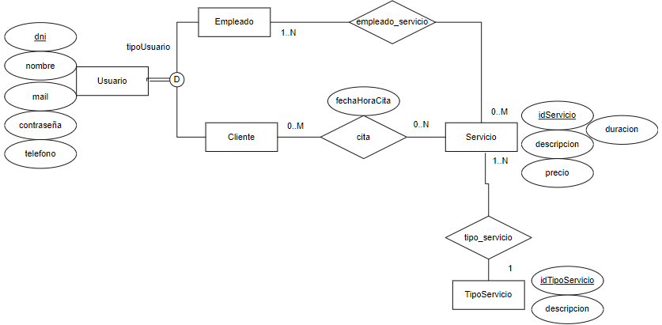

# Propuesta TP DSW

## Grupo
### Integrantes
* 46754, Chaves Laureano Neyén
* 50749, Coux Francisco Julián

### Repositorios
* [frontend app](http://hyperlinkToGihubOrGitlab)
* [backend app](http://hyperlinkToGihubOrGitlab)
*Nota*: si utiliza un monorepo indicar un solo link con fullstack app.

## Sistema para una peluquería
### Descripción
Este sistema otorgará la posibilidad de sacar turno eligiendo un tipo de servicio. Se registrarán los clientes, con un nombre, apellido, mail y número de teléfono. 
Los tipos de servicio que se ofrecen abarcar desde cortes de cabello tradicionales, teñido de cabello y un servicio especial de barbería para los hombres.
Los turnos ofrecidos serán desde el martes hasta el sábado, de 9 a 20 horas, en espacios de aproximadamente de media hora cada uno. Se podrá cancelar el turno hasta el día anterior al mismo.

### Modelo

Link: https://app.diagrams.net/#G1Nb82UCQEkMsSFQqlIaih-E2rsNaBS825

## Alcance Funcional 

### Alcance Mínimo

Regularidad:
|Req|Detalle|
|:-|:-|
|CRUD simple|1. CRUD Tipo Servicio 2. CRUD Empleado |
|CRUD dependiente|1. CRUD Servicio depende de Servicio |
|Listado + detalle| 1. Listado de servicios filtrado por tipo de servicio 
|CUU/Epic|1. Reservar una cita 2. Cancelar una cita|

Adicionales para Aprobación
|Req|Detalle|
|:-|:-|
|CRUD |1. CRUD Tipo Servicio 2. CRUD Servicio 3. CRUD Empleado 4. CRUD Cliente 5. CRUD Cita 6. CRUD Empleado_Servicio |
|CUU/Epic|1. Reservar una cita 2. Cancelar cita 3. Registrar un nuevo cliente 4. Modificar una cita|

### Alcance Adicional Voluntario -VER-

*Nota*: El Alcance Adicional Voluntario es opcional, pero ayuda a que la funcionalidad del sistema esté completa y será considerado en la nota en función de su complejidad y esfuerzo.

