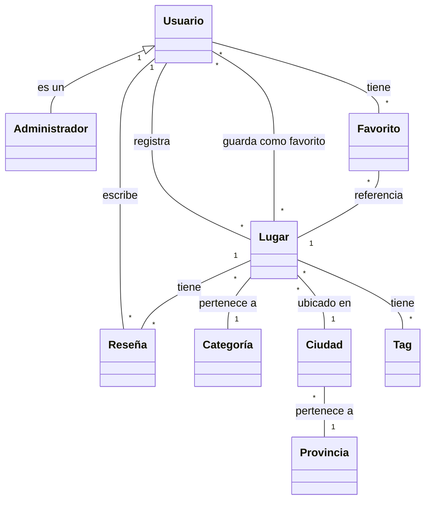

# desarrollo-de-software
TP Desarrollo de Software
# Propuesta TP DSW - Buscador de Locales

## Grupo
**Integrantes:**
- [39233] - Rohr, Claudio
- [52243] - Paz Alvarez, José

## Repositorios

## Tema
**Buscador de Locales: Plataforma de descubrimiento locales dentro de tu ciudad**

## Descripción
Buscador de locales es una aplicación que permite a usuarios descubrir y compartir lugares de interés en su localidad. Los usuarios pueden explorar restaurantes, tiendas, etc. organizados por categorías, además de contribuir con reseñas y recomendaciones propias. El sistema distingue entre usuarios normales y administradores.

## Modelo

## Alcance Funcional

### Alcance Mínimo (Regularidad)

| Req | Detalle |
|-----|---------|
| CRUD simple | 1. CRUD Categoría 2. CRUD Provincia 3. CRUD Usuario |
| CRUD dependiente | 1. CRUD Lugar {depende de} CRUD Categoría y CRUD Ciudad 2. CRUD Reseña {depende de} CRUD Usuario y CRUD Lugar |
| Listado + detalle | **1. Listado de lugares filtrado por categoría**, muestra nombre, dirección y calificación promedio => detalle muestra información completa del lugar  ej: Filtro por "Restaurantes" → muestra "La Pizzería del Centro" (Av. San Martín 123, ⭐4.2), "Burger Palace" (Pellegrini 456, ⭐3.8) → detalle de "La Pizzería del Centro" muestra descripción completa, horarios (Lun-Dom 18:00-00:00), mapa de ubicación, fotos y todas sus reseñas  **2. Listado de reseñas filtrado por lugar**, muestra calificación, fecha y nombre de usuario => detalle muestra contenido completo de la reseña y datos del usuario ej: Reseñas de "La Pizzería del Centro" → muestra reseña de Juan P. (⭐5, 15/05/2024), María L. (⭐4, 10/05/2024) → detalle de reseña de Juan P. muestra comentario completo "Excelente pizza a la piedra, ambiente familiar..." y perfil del usuario (Juan Pérez, miembro desde 2023) |
| CUU/Epic | 1. Buscar lugares cercanos por geolocalización |

### Adicionales para Aprobación

| Req | Detalle |
|-----|---------|
| CRUD | 1. CRUD Ciudad 2. CRUD Favorito (Usuario guarda lugares favoritos) 3. CRUD Tag (etiquetas para lugares: "WiFi gratis", "Pet-friendly", "Estacionamiento") |
| CUU/Epic | 1. Guardar lugares en lista de favoritos 2. Sistema de moderación automática (bot) y manual por administradores |
### Alcance Adicional Voluntario

| Req | Detalle |
|-----|---------|
| Listados | 1. Lugares populares filtrados por calificación promedio, muestra nombre, categoría y calificación 2. Reseñas recientes filtradas por usuario, muestra lugar, calificación y fecha |
| CUU/Epic | 1. Registrar un nuevo lugar en la plataforma 2. Panel de administración con estadísticas y moderación de contenido 3. Notificaciones por email para nuevas reseñas |

## Roles de Usuario

El sistema contempla dos roles principales:

### 1. Usuario Regular
- Puede explorar lugares y leer reseñas
- Puede crear y gestionar su perfil personal
- Puede registrar nuevos lugares en la plataforma
- Puede publicar reseñas sobre lugares visitados
- Puede guardar lugares en su lista de favoritos
- Puede buscar lugares por ubicación, categoría o nombre

### 2. Administrador
- Hereda todas las capacidades del usuario regular
- Puede gestionar categorías (crear, modificar, eliminar)
- Puede moderar reseñas (aprobar, rechazar, eliminar)
- Puede verificar y actualizar información de lugares
- Puede gestionar usuarios (activar, desactivar cuentas)
- Acceso al panel de administración con estadísticas
- Puede gestionar provincias y ciudades del sistema
