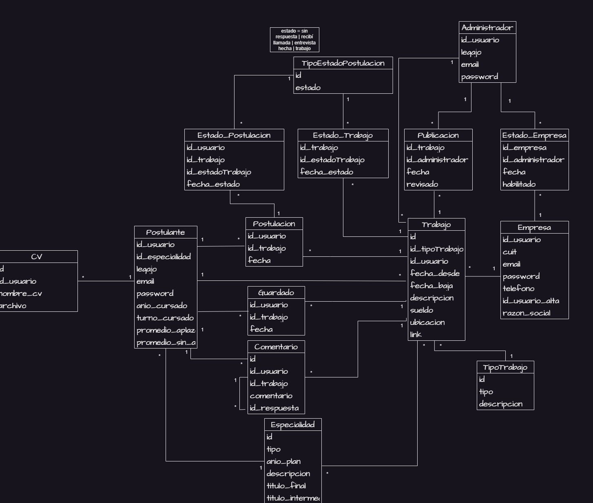

# Propuesta TP DSW

## Grupo

### Integrantes

- 47218 - Mendiburu, Francisco
- 43092 - Cardach, Simon 
- 42734 - Ramaccioti, Gina
- 41831 - Sanchez, Ramiro 

### Repositorios

- [frontend app](http://hyperlinktogihuborgitlab/)
- [backend app](https://github.com/MendiburuFrancisco/BolsaDeTrabajoAPI)

## Tema

### Descripción

La aplicación de bolsa de trabajo busca solucionar los problemas de diseño desactualizado, falta de funcionalidades y dificultad de navegación en la bolsa de trabajo actual de la facultad. La idea es rediseñar el frontend con enfoque en dispositivos móviles y accesibilidad, y ampliar las funciones existentes. Los usuarios podrán postularse a trabajos, subir sus propias ofertas, gestionar el estado de sus postulaciones y tener un historial detallado. Las empresas podrán publicar ofertas, ver candidatos y sus CVs, y los administradores tendrán control sobre los trabajos publicados.

### Modelo

## Alcance Funcional

### Alcance Mínimo

Regularidad:

| Req | Detalle |
| --- | --- |
| CRUD simple | 1. CRUD Usuario   2. CRUD Trabajo 3. CRUD TipoEstadoPostulacion 4. CRUD TipoTrabajo  5. CRUD Especialidad |
| CRUD dependiente |1. CRUD Postulación {depende de} CRUD Trabajo y CRUD Postulante   2. CRUD Guardado {depende de} CRUD Trabajo y CRUD Postulante   3. CRUD CV {depende de} CRUD Postulante  4. CRUD EstadoPostulacion {depende de}  CRUD TipoEstadoPostulacion y CRUD Postulación   5. CRUD TipoUsuario {depende de} CRUD Usuario   6. CRUD Publicación {depende de} CRUD Administrador y CRUD Trabajo   7. CRUD Estado_Empresa {depende de} CRUD Administrador y CRUD Empresa   8. CRUD Trabajo {depende de} CRUD TipoTrabajo y CRUD Postulante | CRUD Empresa | CRUD Administrador |
| Listado+detalle | 1. Listado de las postulaciones del usuario ⇒ detalle CRUD Postulacion  2. Listado de postulantes a un trabajo ⇒ detalle CRUD Postulacion  3. Listado de ofertas de trabajo filtrado por especialidad, titulo, estado y tipo ⇒ detalle CRUD Trabajo  4. Listado de ofertas de trabajo guardadas filtrado por especialidad, titulo, estado y tipo ⇒ detalle CRUD Trabajo  5. Listado de empresas interesadas en postular trabajos ⇒ detalle CRUD Empresas |
| CUU/Epic | 1. Postularse a una oferta de trabajo  2. Guardar una oferta de trabajo  3. Subir una oferta de trabajo 4. Cambiar el estado de postulación 5. Subir CV’s |

Adicionales para Aprobación

| Req | Detalle |
| --- | --- |
| CRUD |1. CRUD Postulante  2. CRUD Administrador  3. CRUD Empresa  4. CRUD TipoEstadoPostulacion  5. CRUD TipoTrabajo  6. CRUD Postulación  7. CRUD Guardado  8. CRUD CV  9. CRUD EstadoPostulacion  10 CRUD EstadoTrabajo  11. CRUD TipoUsuario  12. CRUD Publicación  13. CRUD Estado_Empresa   14. CRUD Trabajo  15. CRUD Comentario |
| CUU/Epic | 1. Postularse a una oferta de trabajo  2. Guardar una oferta de trabajo  3. Subir una oferta de trabajo  4. Cambiar el estado de postulación  5. Subir CV’s  6. Cancelar postulación  7. Agregar comentarios a una postulación  8. Validar empresa como administrador  9. Validar publicación de trabajo como administrador |

### Alcance Adicional Voluntario

*Nota*: El Alcance Adicional Voluntario es opcional, pero ayuda a que la funcionalidad del sistema esté completa y será considerado en la nota en función de su complejidad y esfuerzo.

| Req | Detalle |
| --- | --- |
| Listados |  |
| CUU/Epic |  |
| Otros | 1. Envio por mail de ofertas de trabajo de interés al usuario, por especialidad. 2. Envio por mail automatics al postularse |
