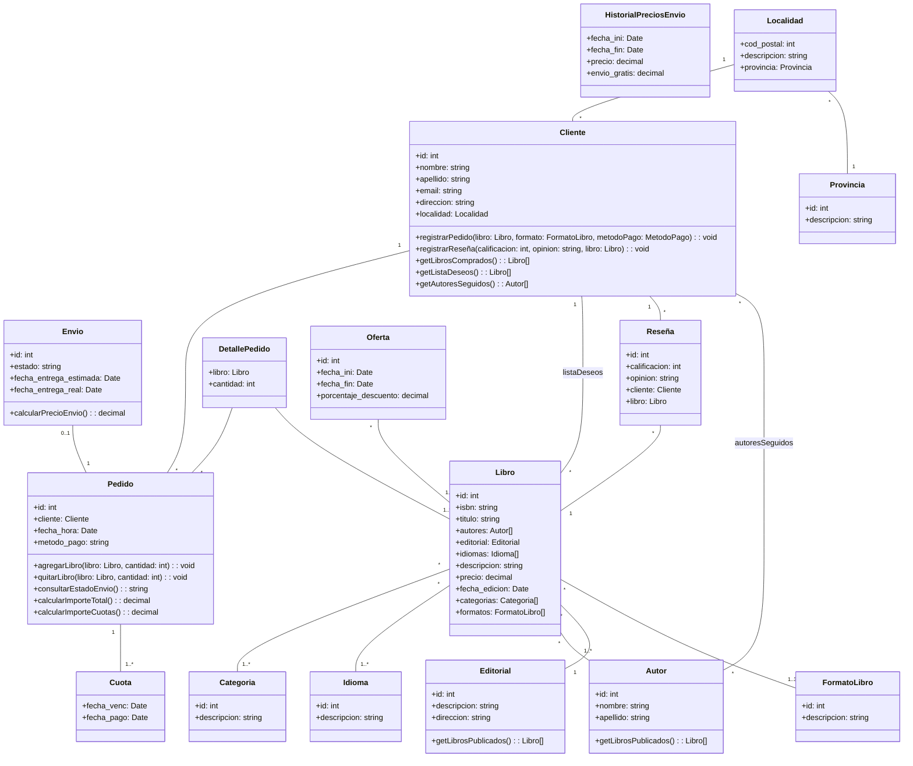

# Propuesta TP DSW

## Grupo 
### Integrantes

* 46950 - Retamal, Alejo
* 47116 - Martel, Marco Antonio
* 48042 - Milo, Marina Ana
* 47141 - Fernandez, Santiago Jesus

### Repositorio

* [frontend app and backend app](https://github.com/AlejoRetamal/Trabajo-Pr-ctico---DdS) 

## Carrito de compras para una librería
### Descripción

Cuando un cliente visita la página web, puede explorar el catálogo de libros filtrándolos por formato, género, autor y otros criterios relevantes. Al hacer clic sobre uno, se muestra una descripción detallada y reseñas de usuarios. El cliente puede agregarlo a su lista de deseos o añadirlo al carrito para consultar métodos de pago y envío. Después de la compra, se envía un comprobante por email con los detalles del pago y la fecha estimada de entrega o retiro.

<!-- Con una interfaz intuitiva y funcionalidades simples, nos permitirá explorar y adquirir libros de manera rápida y conveniente. Podrás encontrar tus títulos favoritos, filtrar por género o autor, reservar libros de una manera más fácil y versatil y más. 

El sistema deberá contar con las siguientes funcionalidades:

* Amplia selección de libros: permitir acceder a una vasta colección de libros en diferentes géneros, temáticas y formatos, incluyendo libros físicos, electrónicos y audiolibros.
* Búsqueda avanzada: permitir al usuario utilizar opciones de búsqueda avanzadas para encontrar fácilmente sus libros favoritos por género, autor, temática y palabras clave específicas.
* Sistema de valoracion por estrellas: el usuario tendra la posibilidad de clasificar el libro adquirido en una escala del 1 al 5.
* Reseñas: permite escribir opiniones sobre los libros que ha leído y también leer las opiniones de otros usuarios.
* Lista de deseos personalizada: crear una lista de deseos con los libros que le interesan al usuario y así comprarlos en otro momento.
* Reservas de libro: realizar reservas de libros antes de su lanzamiento oficial.
* Compatibilidad con diferentes formatos: el usuario podrá escoger entre el formato que quiere el libro. Por ejemplo, si es digital, podrá descargarlo.

*[Pueden agregar más o eliminar si quieren]* -->

### Modelo

#### Anotaciones:
- La clase “**FormatoLibro**” representa los diferentes formatos en los que un libro puede estar disponible, como físico, digital o audiolibro.
- La clase “**Envio**” posee una relación "0..1 a 1" con la clase “**Pedido**”. Esta relación se establece cuando el cliente selecciona la opción de envío.
    - De lo contrario, si se selecciona “**retiro**” la relación no se crea, pues el cliente lo retirará en la librería física.
- La clase “**Cuota**” indica la cantidad de cuotas en las que se pagará un pedido.
    - Si se relaciona con una única instancia de cuota, significa que el pedido se pagará en su totalidad con tarjeta de débito.
    - Si se relaciona con más de una instancia de cuota, el pago se efectuará con tarjeta de crédito.
        - El importe de cada cuota se puede calcular invocando el método “**calcularImporteCuotas()**”
- La clase “**HistorialPreciosEnvio**” permite que el importe de los envíos pueda actualizarse sin perder los anteriores para poder consultar el historial de compras del cliente más adelante.
    - Si el importe total del pedido (sin incluir el costo del envío) supera el valor establecido en el atributo "**envio_gratis**", el envío se considera gratuito.
        - Esto proporciona una forma de determinar si el cliente califica para recibir envío gratuito en función del monto de su compra.
- La clase “**Reseña**” posee un atributo “**calificación**” con tipo de dato *int* que admitirá valores de 1 a 5 para determinar la cantidad de estrellas con las que calificó el cliente al libro.

#### Consultas:
- ¿Es conveniente tener una clase separada para el **idioma** de un libro o deberíamos incluir un atributo "**idioma**" en la clase "**Libro**" en su lugar?
    - Esta pregunta surge debido a que el título, la editorial, la descripción y los formatos disponibles de un libro **pueden variar según el idioma en el que esté escrito**.
        - Al incluir el atributo "**idioma**" en la clase "**Libro**", los libros escritos en diferentes idiomas serán tratados como distintos en el sistema.
        - Además, las reseñas de los clientes pueden diferir según el idioma en el que esté escrito el libro.
- ¿Es recomendable incluir el atributo "**método_pago**" en la clase "**Pedido**" y tener una clase separada llamada "**Cuota**" para permitir el pago con tarjeta de crédito?
    - ¿Existe una forma más eficiente y sencilla de modelar esta situación?

<!--  (Aún no está terminado, iré a consulta para ver qué cambiar)

*Nota*: incluir un link con la imagen de un modelo, puede ser modelo de dominio, diagrama de clases, DER. Si lo prefieren pueden utilizar diagramas con [Mermaid](https://mermaid.js.org) en lugar de imágenes. -->

## Alcance Funcional 

<!-- Edité las tablas para que sean para un grupo de 4 integrantes -->

### Alcance Mínimo
- **Regularidad:**

|Req|Detalle|
|:-|:-|
|CRUD Simple|1. CRUD Categoría 2. CRUD Provincia 3. CRUD Cliente 4. CRUD Autor|
|CRUD Dependiente|1. CRUD Libro { depende de } CRUD Categoría y CRUD Autor 2. CRUD Envio { depende de } CRUD Provincia|
|Listado + Detalle| 1. Listado de todos los libros filtrando por categoría, muestra código de libro, título de libro, precio de libro, estado de libro => detalle CRUD Libro  2. Listado de localidades disponibles, filtrado por localidad del cliente, muestra todas las  localidades y su estado (Mostraría todas las localidades que hay y su estado sería si hacen envio a esa en específico)  |
|CUU/Epic|1. Comprar un libro 2. Reseñar un libro 3. Calificar un libro |

- **Adicionales para Aprobación:**

|Req|Detalle|
|:-|:-|
|CRUD |1. CRUD Libro 2. CRUD Envío 3. CRUD Cliente 4. CRUD Autor 5. CRUD Pedido 6. CRUD Ofertas| (Creo que habria que agregar más)
|CUU/Epic|1. Comprar un libro 2. Consultar estado de envío 3. Reseñar un libro 4. Calificar un libro 5. Registrar cliente|

### Alcance Adicional Voluntario

<!--- Es opcional, pero ayuda a que la funcionalidad del sistema esté completa y será considerado en la nota en función de su complejidad y esfuerzo --->

(Abierto a edición)
|Req|Detalle| 
|:-|:-|
|Listados|1. Listado de libros por autor 2. Listado de libros comprados 3. Listado de autores seguidos 4. Listado de libros agregados a la lista de deseos|
|CUU/Epic|1. Consultar historial de compras 2. Agregar libro a lista de deseos 3. Seguir a autor|
|Otros|1. ...|
