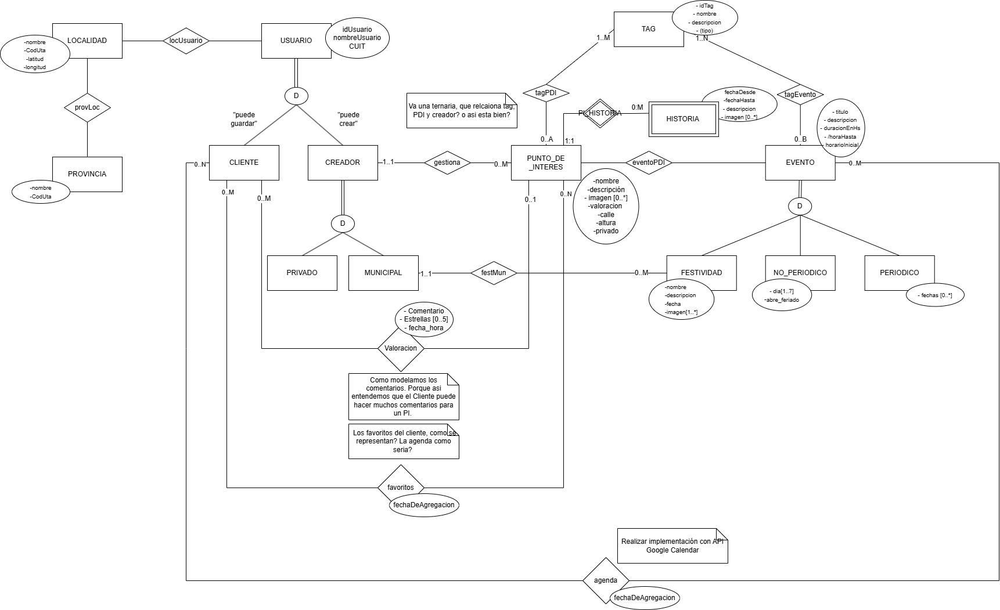

# Propuesta TP DSW

## Grupo
### Integrantes
* 52805 - Laveggi, Valentino (Comisión 303)
* 53402 - Murúa, Joaquín Tomás (Comisión 303)
* 52937 - Romero, Gabriel Tobías (Comisión 304)

### Repositorios
* [frontend app](https://github.com/Evenaut7/TP_DSW_FrontendApp.git)
* [backend app](https://github.com/Evenaut7/TP_DSW_BackendApp.git)

## Tema
### Descripción
El modelo de negocio planteado permite a un usuario conocer los puntos de interés de una localidad , actividades disponibles para realizar, su historia y los comentarios de otros usuarios acerca de dicha localidad. 

### Modelo

* [Draw.io](https://drive.google.com/file/d/1wmEwmmVv6VVJS08DoNGEGxvJpjB_NxlN/view?usp=sharing)

## Alcance Funcional 

### Alcance Mínimo
Regularidad:
|Req|Detalle|
|:-|:-|
|CRUD simple|1. CRUD Localidad  2. CRUD Tag 
|CRUD dependiente|1. CRUD Usuario {depende de} CRUD ?  2. CRUD PuntoInteres{depende de} CRUD Localidad   3. CRUD Evento {depende de} CRUD PuntoInteres|
|Listado + detalle| 1. Listado de Evento  => Detalle muestra nombre del evento, una imagen de la actividad, tipo de evento, fecha más próxima y horario. 2. Listado de Puntos de interés => Detalle muestra una imagen del punto de interés, nombre, y breve descripción  3. Búsqueda de eventos y puntos de intereses mediante tags.|
|CUU/Epic|1. Evento (crear + notificación) 2. Realizar una valoración sobre un punto de interés.|

Adicionales para Aprobación:
|Req|Detalle|
|:-|:-|
|CRUD |1. CRUD Festividad  2. CRUD Historia 3. CRUD Provincia 4. CRUD Localidad 5. CRUD Tag 6. CRUD Cliente 7. CRUD Creador  8. CRUD Evento 9. CRUD Comentario 10. CRUD Municipal 11. CRUD Privado 12. CRUD Favorito 13. CRUD Agenda 14. CRUD PuntoDeInteres|
|CUU/Epic|1. Visualizar recomendaciones personalizadas.  2. Guardar un evento en la agenda. 3. Guardar un punto de interés en favoritos.|

### Alcance Adicional Voluntario
|Req|Detalle|
|:-|:-|
|Listados|1. Buscar eventos y puntos de interés por tags  2. Listar historial de eventos en un punto de interés par un creador 

## Reglas de Negocio (RN)

### Usuarios

- **RN01**: Un usuario tiene mail, ID, nombre de usuario y CUIT únicos.
- **RN02**: Un usuario puede ser **cliente** o **creador**, pero no ambos.
- **RN03**: Un usuario cliente puede marcar puntos de interés como **favoritos**.
- **RN04**: Un usuario cliente puede agregar eventos a su lista de eventos. También puede **sincronizar su agenda personal de Google** y agregar los eventos a su agenda.
- **RN05**: Un usuario cliente puede realizar **una sola valoración** (comentario + puntuación + fecha) por punto de interés.
- **RN06**: Una valoración solo puede ser **eliminada por el usuario que la creó**.
- **RN07**: Un creador puede ser **municipal** o **privado**, no ambos.
- **RN08**: Todo usuario (cliente o creador) debe pertenecer a **una única localidad**.

### Localidades

- **RN37**: Una localidad tiene **un único usuario creador municipal**.
- **RN29**: Cada localidad pertenece a **una única provincia**.

### Puntos de Interés

- **RN10**: Solo los **usuarios creadores** pueden gestionar (**CRUD**) puntos de interés.
- **RN11**: Un punto de interés representa un lugar físico (parque, cine, restaurante, etc.).
- **RN12**: Un punto de interés puede ser **público o privado**.
- **RN13**: Si el punto de interés es público, **cualquier creador** puede gestionar eventos en él.
- **RN14**: Si el punto de interés es privado, **solo su dueño (creador privado)** puede gestionar eventos allí.
- **RN15**: Un punto de interés puede tener **uno o varios tags**.
- **RN16**: Los puntos de interés pueden ser **valorados por clientes**.
- **RN17**: Los puntos de interés están asociados a **una única localidad**.
- **RN30**: Los puntos de interés pertenecen a **localidades específicas**.

### Eventos

- **RN09**: Un usuario creador puede gestionar (**CRUD**) eventos, según las reglas de propiedad del punto de interés.
- **RN18**: Un evento ocurre en **uno o varios puntos de interés** y tiene un **creador**.
- **RN19**: Un evento puede tener **uno o varios tags**.
- **RN20**: Un evento puede ser **periódico, no periódico o festividad**.
- **RN21**: Un evento tiene **fecha y hora de inicio y de fin**.
- **RN22**: Los eventos se agregan a la **agenda del cliente**, no a favoritos.
- **RN23**: Las **festividades** son eventos creados exclusivamente por **creadores municipales**.
- **RN24**: Un creador municipal solo puede gestionar festividades **dentro de su propia localidad**.
- **RN25**: Las festividades pueden realizarse en puntos de interés **públicos o privados** de su localidad.
- **RN26**: Una festividad requiere **descripción obligatoria**; la **imagen es opcional**.
- **RN30**: Los eventos pertenecen a **localidades específicas**.

### Tags

- **RN27**: Los tags se asignan a **eventos y puntos de interés**.
- **RN28**: Los tags no pueden ser creados por usuarios; existe un **catálogo fijo** definido por el sistema.

### Integraciones

- **RN31**: El sistema debe integrarse con **Google Calendar** para mostrar eventos en la agenda. La sincronización debe ser de **lectura y escritura** (crear eventos directamente en el calendario del usuario).

### Funcionalidades Especiales

- **RN34**: El modo "**Explorá tu ciudad**" solo muestra eventos y puntos de interés de la **localidad del usuario cliente**. El sistema puede mostrar **contenido personalizado** basado en la localidad del usuario al iniciar sesión.
