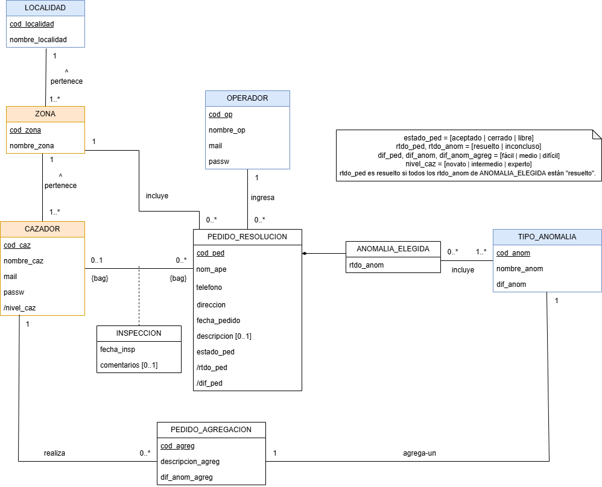

# Propuesta TP DSW

## Grupo

### Integrantes

- 53082 - Tomasino, Alvaro
- 52058 - Aronson, Melina

### Repositorios

- [frontend app](http://hyperlinkToGihubOrGitlab)
- [backend app](http://hyperlinkToGihubOrGitlab)

## Tema

### Descripción

#### Resolución de anomalías

En Rosario están ocurriendo Anomalías producidas por Fantasmas. Para solucionarlo, se crea un sistema capaz de asignar Pedidos de Resolución de Anomalías a valientes Cazadores, que son los únicos capaces de lidiar con ellas. Estos Pedidos son cargados al sistema por un Operador, que es contactado por teléfono por la gente de la ciudad. El Operador genera un Pedido de Resolución, y detalla la Anomalía a resolver. Luego, el Cazador acepta un Pedido de Resolución y, una vez resuelto (o no), detalla su información.

### Modelo

[Link del modelo (Draw.io)](https://app.diagrams.net#G1-IVL3tP7jw7QF192Rc02GROQfhCnMEic)

## Alcance Funcional

### Alcance Mínimo

Regularidad:
|Req|Detalle|
|:-|:-|
|CRUD simple|1. CRUD Tipo de Anomalía 2. CRUD Zona|
|CRUD dependiente|1. CRUD Cazador {depende de} CRUD Zona|
|Listado + detalle| 1. Listado de Pedidos de Resolución filtrado por su dificultad, muestra código del pedido de resolución y dificultad de la anomalía => detalle CRUD Pedido de Resolución  2. Listado de Inspecciones filtrado por su resultado, muestra código del pedido de resolución y resultado de la Inspección => detalle CRUD Inspección|
|CUU/Epic|1. Generar Pedido de Resolución|

Adicionales para Aprobación
|Req|Detalle|
|:-|:-|
|CRUD |1. CRUD Operador 2. CRUD Cazador|
|CUU/Epic|1. Registrar Inspección Generar 2. Pedido de Agregación de Anomalía|
