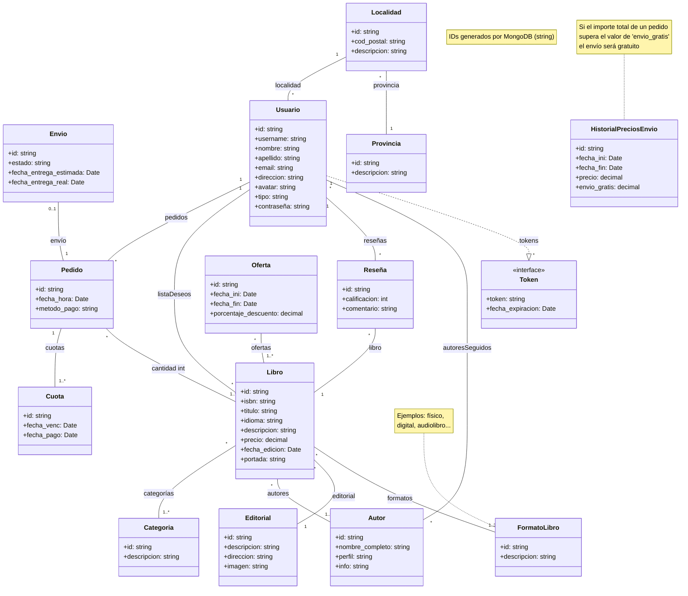

# Propuesta TP DSW

## Grupo

### Integrantes

-   46950 - Retamal, Alejo
-   48042 - Milo, Marina Ana

### Repositorio

-   [frontend app and backend app](https://github.com/AlejoRetamal/Trabajo-Pr-ctico---DdS)

## Carrito de compras para una librería

### Descripción

Cuando un cliente visita la página web, puede explorar el catálogo de libros filtrándolos por formato, categoría, autor y otros criterios relevantes. Al hacer clic sobre uno, se muestra una descripción detallada y reseñas de usuarios. El cliente puede agregarlo a su lista de deseos o añadirlo al carrito para consultar métodos de pago y envío. Después de la compra, se envía un comprobante por email con los detalles del pago y la fecha estimada de entrega o retiro.

<!-- Con una interfaz intuitiva y funcionalidades simples, nos permitirá explorar y adquirir libros de manera rápida y conveniente. Podrás encontrar tus títulos favoritos, filtrar por género o autor, reservar libros de una manera más fácil y versatil y más.

El sistema deberá contar con las siguientes funcionalidades:

* Amplia selección de libros: permitir acceder a una vasta colección de libros en diferentes géneros, temáticas y formatos, incluyendo libros físicos, electrónicos y audiolibros.
* Búsqueda avanzada: permitir al usuario utilizar opciones de búsqueda avanzadas para encontrar fácilmente sus libros favoritos por género, autor, temática y palabras clave específicas.
* Sistema de valoracion por estrellas: el usuario tendra la posibilidad de clasificar el libro adquirido en una escala del 1 al 5.
* Reseñas: permite escribir opiniones sobre los libros que ha leído y también leer las opiniones de otros usuarios.
* Lista de deseos personalizada: crear una lista de deseos con los libros que le interesan al usuario y así comprarlos en otro momento.
* Reservas de libro: realizar reservas de libros antes de su lanzamiento oficial.
* Compatibilidad con diferentes formatos: el usuario podrá escoger entre el formato que quiere el libro. Por ejemplo, si es digital, podrá descargarlo. -->

### Modelo

## Alcance Funcional

### Alcance Mínimo

#### Regularidad:

| Req                     | Detalle                                                                                                                                                                                                                                  |
| :---------------------- | :--------------------------------------------------------------------------------------------------------------------------------------------------------------------------------------------------------------------------------------- |
| CRUD Simple             | 1. CRUD Autor 2. CRUD Editorial                                                                                                                                                             |
| CRUD Dependiente        | 1. CRUD Libro **{depende de}** CRUD Autor, CRUD Categoría y CRUD Editorial.                                                                                                        |
| Listado + Detalle | 1. Listado de libros filtrado por categoría, muestra ISBN, título, autores, editorial y precio → **detalle CRUD Libro**.  2. Listado de libros filtrado por autor, muestra ISBN, título, editorial y precio → **detalle CRUD Libro**. |
| CUU/Epic                | 1. Comprar libro 2. Reseñar libro                                                                                                                                                                                         |

-   **Consideraciones:**

    **[i]** El CRUD de Usuario se desarrollará en el alcance para la promoción. En el alcance para la regularidad, para garantizar la funcionalidad del sistema, se incluirá un par de clientes preexistentes.

    **[ii]** El CRUD de los Formatos de los Libros no se implementará, pues estarán previamente cargados e incluíran opciones como: físico, digital y audiolibro.

---

#### Adicionales para Aprobación:

| Req      | Detalle                                                                                                                                                                                                                                            |
| :------- | :------------------------------------------------------------------------------------------------------------------------------------------------------------------------------------------------------------------------------------------------- |
| CRUD     | 1. CRUD Provincia 2. CRUD Autor 3. CRUD Categoría 4. CRUD Editorial 5. CRUD Localidad 6. CRUD Usuario 7. CRUD Libro 8. CRUD Reseña 9. CRUD Oferta 
| CUU/Epic | 1. Comprar libro 2. Reseñar libro 3. Registrar Editorial 4. Registrar Autor                                                                                                                                                      |

-   **Consideraciones:**

...

---

### Alcance Adicional Voluntario

<!--- Es opcional, pero ayuda a que la funcionalidad del sistema esté completa y será considerado en la nota en función de su complejidad y esfuerzo. Pero por ahora no se llevará a cabo nada extra.

| Req      | Detalle                                                                                                                                                                                                                                                                                                                                                                                                                                                                     |
| :------- | :-------------------------------------------------------------------------------------------------------------------------------------------------------------------------------------------------------------------------------------------------------------------------------------------------------------------------------------------------------------------------------------------------------------------------------------------------------------------------- |
| Listados | 1. Listado de ofertas vigentes filtrado por fecha actual, muestra fecha de fin, porcentaje de descuento y libros. 2. Listado de pedidos filtrado por usuario, muestra fecha y hora, estado, importe total, método de pago y libros adquiridos con su cantidad. 3. Listado de autores seguidos filtrado por usuario, muestra nombre y apellido. 4. Listado de libros en la lista de deseos filtrado por usuario, muestra ISBN, título, autores, editorial y precio. |
| CUU/Epic | 1. Consultar historial de compras 2. Agregar libro a lista de deseos 3. Seguir a autor                                                                                                                                                                                                                                                                                                                                                                                |
| Otros    | 1. Envío de comprobante de compra con los detalles del pago y la fecha estimada de entrega o retiro por email.                                                                                                                         --->                                                                                                                                                                                                                        
...
