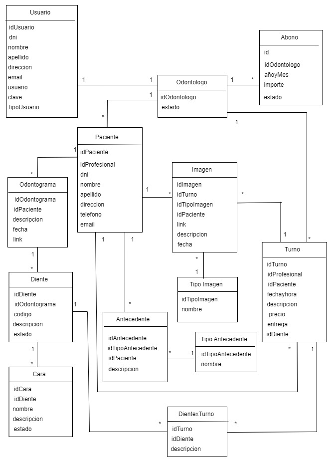
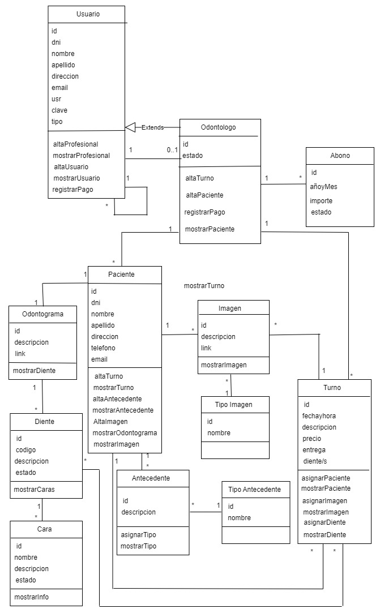

# Propuesta TP DSW

## Grupo
### Integrantes
* 49499 Condori Sosa, Juan Ignacio
* 24919 Hernández, Fabrik
* 41514 Contreras, Sebastian

### Repositorios
* [frontend app](https://github.com/condorijuan/TP_DSW_Frontend)
* [backend app](https://github.com/condorijuan/TP_DSW_Backend)

## Tema
### Descripción
Sistema para una clinica odontologica en el cual es el profecional el que le proporciona los turnos a los paciente, estos solo pueden comunicarse y solicitar con los profesionales y consultar sobre sus turnos. El profecional puede acceder y escribir sobre el historial clinico del paciente.

### Modelo

Modelo de Datos:

Modelo de Dominio:

## Alcance Funcional 

### Alcance Mínimo

Regularidad:
|Req|Detalle|
|:-|:-|
|CRUD simple|1. CRUD Paciente 2. CRUD Profesional 3. CRUD Odontograma 4. CRUD Turno 5. CRUD imagen|
|CRUD dependiente|1. CRUD Tipo Imagen {depende de} CRUD Imagen 2. CRUD Diente {depende de} CRUD Odontograma|
|Listado + detalle| 1.Listado de tratamientos recibidos del paciente  2. Listado de Profesionales disponibles para un día determinado|
|CUU/Epic|1. Realizar una turno en la clínica odontológica 2. Registro tratamientos hechos en el turno|

Adicionales para Aprobación
|Req|Detalle|
|:-|:-|
|CRUD |1. CRUD Abono 2. CRUD Alergias 3. CRUD Antecedentes genético 4. CRUD tipo Antecedente|
|CUU/Epic|1. Realizar una turno en la clínica odontológica 2. Registro de antecendentes medicos 3. Pedido de restablecimiento de fecha de turno|

### Alcance Adicional Voluntario

|Req|Detalle|
|:-|:-|
|Listados |1. Lista de todas las citas que tenga un profesional para un dia|
|CUU/Epic|1. Establecimiento de horario de trabajo (por el profesional)|
|Otros|1. Envío de recordatorio de cita por gmail|

