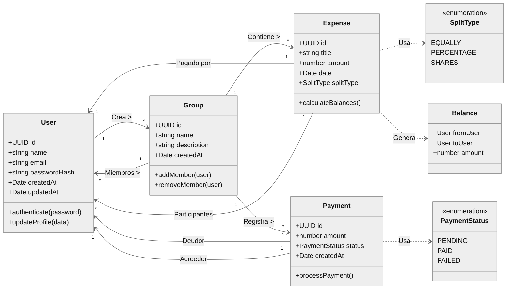

# Propuesta TP DSW

## Grupo
### Integrantes
* 48096 - Ruiz Aldea, Bautista
* 48011 - Gonzalez del Cerro, Iñaki
* 48813 - Ricobelli, Tomas

### Repositorios
* [frontend app](http://hyperlinkToGihubOrGitlab)
* [backend app](http://hyperlinkToGihubOrGitlab)

## Software para gestión de gastos compartidos
### Descripción
*Esta aplicación permite a los usuarios registrar y dividir gastos dentro de un grupo de manera eficiente y equitativa. Los integrantes pueden agregar sus gastos, visualizar deudas y saldar montos a través de transferencias dentro de la plataforma. Nuestra app ofrece a su vez un historial detallado con los montos y motivos de cada gasto, brindando un control organizado de las finanzas compartidas para el día a día.*

### Modelo

# Paym8 - Diagrama de Clases

*Nota*: incluir un link con la imagen de un modelo, puede ser modelo de dominio, diagrama de clases, DER. Si lo prefieren pueden utilizar diagramas con [Mermaid](https://mermaid.js.org) en lugar de imágenes.

## Alcance Funcional 

### Alcance Mínimo

Regularidad:
|Req|Detalle|
|:-|:-|
|CRUD simple|1. CRUD User 2. CRUD Group 3. CRUD Expense 4. CRUD Payment|
|CRUD dependiente|1. CRUD Balance {depende de} CRUD Tipo Expense 2. CRUD SplitType {depende de} CRUD Expense 3. CRUD PaymentStatus {depende de} CRUD Payment|
|Listado + detalle| 1. Listado de Gastos filtrado por monto, periodo de tiempo, usuarios y categoría => detalle CRUD Expense 2. Listado de Deudas filtrado por estado, usuario y tipo de gasto => detalle CRUD Payment|
|CUU/Epic|1. Visualización unificada de deudores y acreedores para facilitar el seguimiento y saldar cuentas 2. Analisis de Gastos y reportes personalizados|

Adicionales para Aprobación
|Req|Detalle|
|:-|:-|
|CRUD|1. CRUD Usuario 2. CRUD Grupo 3. CRUD Gasto 4. CRUD Liquidácion 5. CRUD Categoria de Gasto 6. CRUD Recordatorio de Pago |
|CUU/Epic|1. Simplificacion de Deudas 2. Analisis de Gastos y reportes personalizados|

### Alcance Adicional Voluntario

*Nota*: El Alcance Adicional Voluntario es opcional, pero ayuda a que la funcionalidad del sistema esté completa y será considerado en la nota en función de su complejidad y esfuerzo.

|Req|Detalle|
|:-|:-|
|Listados |1. Estadía del día filtrado por fecha muestra, cliente, habitaciones y estado  2. Reservas filtradas por cliente muestra datos del cliente y de cada reserve fechas, estado cantidad de habitaciones y huespedes|
|CUU/Epic|1. Consumir servicios 2. Cancelación de reserva|
|Otros|1. Envío de recordatorio de reserva por email|

