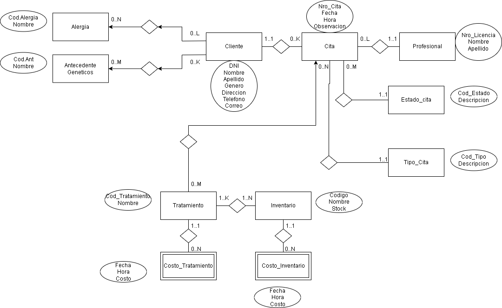

# Propuesta TP DSW

## Grupo
### Integrantes
* 49499 Condori Sosa, Juan Ignacio
* 24919 Hernández, Fabrik
* 41514 Contreras, Sebastian

### Repositorios
* [frontend app](https://github.com/condorijuan/TP_DSW_Frontend)
* [backend app](https://github.com/condorijuan/TP_DSW_Backend)

## Tema
### Descripción
Sistema para una clinica odontologica en el cual es el profecional el que le proporciona los turnos a los paciente, estos solo pueden comunicarse y solicitar con los profesionales y consultar sobre sus turnos. El profecional puede acceder y escribir sobre el historial clinico del paciente.

### Modelo

## Alcance Funcional 

### Alcance Mínimo

Regularidad:
|Req|Detalle|
|:-|:-|
|CRUD simple|1. CRUD Cliente 2. CRUD Profesional 3. CRUD Tratamiento 3. CRUD Estado_Cita 3. CRUD Tipo_Cita|
|CRUD dependiente|1. CRUD Cita {depende de} CRUD Cliente y Profesional 2. CRUD Costo_Tratamiento {depende de} CRUD|
|Listado + detalle| 1.Listado de tratamientos recibidos del paciente => Historia Clinica  2. Listado de Profesionales disponibles para un día determinado|
|CUU/Epic|1. Realizar una cita en la clínica odontológica 2. Registro de tratamientos en el Historial clínico|

Adicionales para Aprobación
|Req|Detalle|
|:-|:-|
|CRUD |1. CRUD Inventario 2. CRUD Alergias 3. CRUD Antecedentes genético 4. CRUD Costo_Inventario|
|CUU/Epic|1. Realizar una cita en la clínica odontológica 2. Registro de tratamientos en el Historial clínico 3. Generación y consulta de factura|

### Alcance Adicional Voluntario

|Req|Detalle|
|:-|:-|
|Listados |1. Lista de todas las citas que tenga un profesional para un dia|
|CUU/Epic|1. Administración de cantidad de inventario o establecimiento de horario de trabajo (por el profesionalidad)|
|Otros|1. Envío de recordatorio de cita por gmail|

