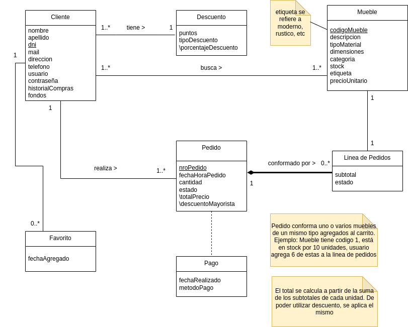

# Propuesta TP DSW

## Grupo

### Integrantes

- 47403 - Gómez, Agustín
- 46804 - Pitavino, Tomás
- 52967 - Bertotti, Santino
- 49806 - Zajarías Enzo

### Repositorios

- [frontend app](http://hyperlinkToGihubOrGitlab)
- [backend app](https://github.com/lordagustin22/ECommerce-dsw-backend)

## Tema

### Descripción

Esto es un E-commerce de una mueblería. Los clientes podrán buscar, filtrar cada producto en un catálogo que se les muestra, así como agregarlos a favoritos. Los productos se pueden agregar directamente al carrito o pasar al checkout inmediatamente. Al hacer checkout se puede elegir el medio de pago que más le convenga al cliente. Conforme un cliente compra muchos productos, se les va otorgando puntos que les permitirán tener descuentos. Los costos de envío se reducirán cuando los clientes compren en mucha cantidad. Las compras en mucha cantidad son consideradas como compras mayoristas. Hay un sistema de reseñas donde cada cliente puede dejar su opinión del producto.

Los administradores pueden subir, actualizar, gestionar y borrar cada uno de los productos.

### Modelo

## Alcance Funcional

### Alcance Mínimo

Regularidad:
|Req|Detalle|
|:-|:-|
|CRUD simple|1. CRUD Cliente 2. CRUD Pedido 3. CRUD Mueble|
|CRUD dependiente|1. CRUD Pago {depende de} CRUD Pedido 2. CRUD Descuento {depende de} CRUD Cliente|
|Listado + detalle| 1. Listado de muebles filtrado por categoría y etiqueta de mueble, muestra nombre, precio y stock => detalle CRUD Mueble  2. Listado de productos en carrito filtrado por rango de fecha, muestra nro de producto, cantidad pedida, descuento si es aplicable, estado y nombre del cliente => detalle muestra datos completos del pedido y del cliente|
|CUU/Epic|1. Agregar un producto al carrito  2. Realizar el pago del pedido|

Adicionales para Aprobación
|Req|Detalle|
|:-|:-|
|CRUD |1. CRUD Cliente 2. CRUD Mueble 3. CRUD Pedido 4. CRUD Pago 5. CRUD Descuento 6. CRUD Favorito 7. Historial|
|CUU/Epic|1. Agregar un producto al carrito  2. Realizar pago del pedido  3. Otorgar puntos en base a la cantidad de compras del cliente  4. Agregar dinero a wallet del cliente 5. Retirar dinero de wallet de cliente|

### Alcance Adicional Voluntario

| Req      | Detalle                                                                                                                                                                                                                                                                                                                                                                                                                                                                                              |
| :------- | :--------------------------------------------------------------------------------------------------------------------------------------------------------------------------------------------------------------------------------------------------------------------------------------------------------------------------------------------------------------------------------------------------------------------------------------------------------------------------------------------------- |
| Listados | 1. Filtrado de productos agregados a favoritos ordenados por fecha (de agregado a favoritos), muestra mueble, cliente y fondos  2. Historial de productos comprados filtrados por cliente muestra datos del cliente y de cada producto fechas, estado, descripcion del producto, stock, categoria y etiqueta 3. Historial de productos comprados por el cliente filtrados por un rango de fechas, muestra fecha de pago realizado, cantidad comprada, precio unitario, subtotal y precio total |
| CUU/Epic | 1. Cancelación de pedido 2. Cancelación de pedidos                                                                                                                                                                                                                                                                                                                                                                                                                                                |
| Otros    | 1. Alertas cuando un producto favorito baja de precio o vuelve a stock.                                                                                                                                                                                                                                                                                                                                                                                                                              |

1. Modelado del Negocio

- Clientes:

  - Compradores de muebles

- Administradores:

  - Gestionan catálogo, pedidos y usuarios.

2. Requisitos Funcionales

   - Para Clientes:

     - Registro/login (email o redes sociales).
     - Catálogo de muebles con filtros (categoría, precio, material).
     - Carrito de compras + checkout
     - Historial de pedidos.
     - Reseñas y ratings.

   - Para Administradores:

     - Panel de control (CRUD de productos, usuarios).
     - Gestión de inventarios
     - Dashboard de ventas
     - Gestión de envíos

3. MVP (Mínimo Producto Viable)

   - Fase 1: Catálogo + carrito + checkout básico.
   - Fase 2: Administrador + Usuario + Autenticación + panel de administrador.
   - Fase 3 (opcional): Dashboard de ventas + reseñas + integración con logística.
