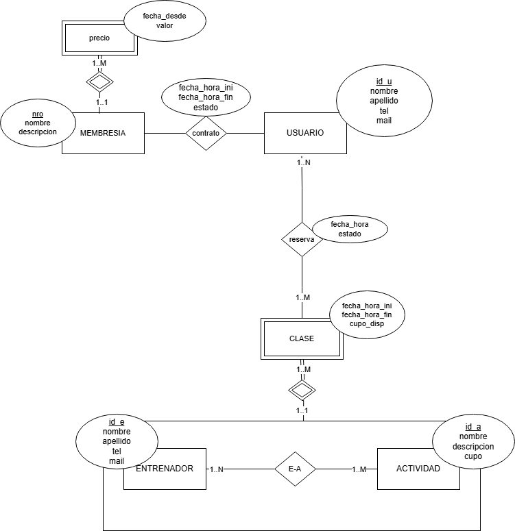

# GYM-DSW
 Sistema de Gestión para Gimnasios 
# Propuesta TP DSW
Este es un sistema web full stack diseñado para la administración de gimnasios. Permite gestionar usuarios, planes de entrenamiento, reservas de clases y planes. 
## Grupo
### Integrantes
* 51027 - Arce Nahuel
* 50947 - Bolcatto Lucía Belén
* 51392 - Rallip Sánchez Ismael
  
### Repositorios
* [frontend ap](http://hyperlinkToGihubOrGitlab)
* [backend app](http://hyperlinkToGihubOrGitlab)

## Tema
### Descripción
Sistema web para la gestión de gimnasios. Permite la administración de usuarios (socios, entrenadores ), reservas de clases y control de pagos .

### Modelo

## Alcance Funcional 

### Alcance Mínimo

Regularidad:
|Req|Detalle|
|:-|:-|
|CRUD simple|1. CRUD Actividad  2. CRUD Membresia  3. CRUD Usuario  |
|CRUD dependiente|1. CRUD Precio {depende de} CRUD Membresia  2. CRUD Clase {depende de} CRUD Actividad |
|Listado + detalle| 1. Listado de usuarios filtrado por estado, muestra id_u Usuario, nombre y apellido Usuario, estado Contrato y nombre Membresia. => detalle CRUD Membresia,  CRUD Usuario   2. Listado de reservas filtradas por clases, muestra id_a Actividad, nombre Actividad , id_u Usuario, nombre y apellido Usuario, fecha-hora-ini y fecha-hora-fin Clase => detalle CRUD Usuario , CRUD Actividad y CRUD Clase |
|CUU/Epic|1. Reservar una clase.  2. Contratar Membresia|

Adicionales para Aprobación
|Req|Detalle|
|:-|:-|
|CRUD | CRUD Entrenador   |
|CUU/Epic|1. Reservar una clase.  2. Contratar Membresia  3.Valoración de Entrenadores  |

### Alcance Adicional Voluntario

|Req|Detalle|
|:-|:-|
|Listados | A definir  |
|CUU/Epic|1. Cancelar reserva   |
|Otros|1. Notificación previa a turno  2. Pago digital  3. Chatbot |
