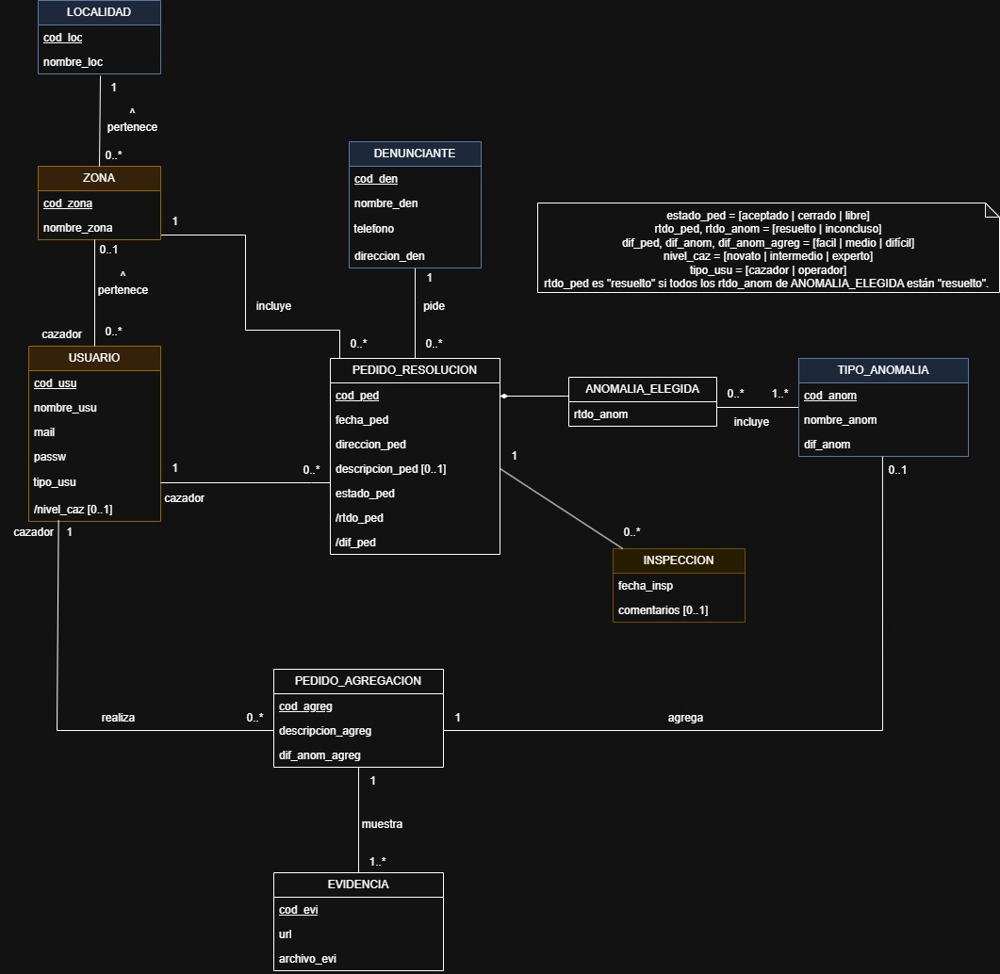

# Propuesta TP DSW

## Grupo

### Integrantes

- 53082 - Tomasino, Alvaro
- 52058 - Aronson, Melina
- 53227 - Aguilera, Tomas

### Repositorios

- [frontend app](https://github.com/tomasinoalvaro48/DSWTP_FrontEnd)
- [backend app](https://github.com/tomasinoalvaro48/DSWTP_BackEnd)

## Tema

### Descripción

#### Resolución de anomalías

En la provincia de Santa Fe están ocurriendo Anomalías producidas por Fantasmas. Para solucionarlo, se crea un sistema capaz de asignar Avistamientos de Anomalías a Cazadores. Estos Avistamientos son cargados al sistema por un Operador, que es contactado por teléfono por la gente. El Operador genera un Pedido de Resolución, y detalla la Anomalía y el lugar del avistamiento. Luego, el Cazador acepta un Pedido de Resolución, según su zona y localidad y, una vez resuelto, detalla su información. El Cazador puede no resolver la Anomalía.

### Modelo

[Link del modelo (Draw.io)](https://app.diagrams.net/#G1-IVL3tP7jw7QF192Rc02GROQfhCnMEic#%7B%22pageId%22%3A%22ytz_YsIWZ9DYHRH7kDpo%22%7D)

## Alcance Funcional

### Alcance Mínimo

Regularidad:
|Req|Detalle|
|:-|:-|
|CRUD simple|1. CRUD Tipo de Anomalía 2. CRUD Localidad 3. CRUD Operador|
|CRUD dependiente|1. CRUD Cazador {depende de} CRUD Zona 2. CRUD Zona {depende de} CRUD Localidad|
|Listado + detalle| 1. Listado de Pedidos de Resolución filtrado por su dificultad, muestra código del pedido de resolución y dificultad de la anomalía => detalle CRUD Pedido de Resolución  2. Listado de Inspecciones filtrado por su resultado, muestra código del pedido de resolución y resultado de la Inspección => detalle CRUD Inspección|
|CUU/Epic|1. Generar Pedido de Resolución 2. Registrar Inspección|

Adicionales para Aprobación:
|Req|Detalle|
|:-|:-|
|CRUD |1. CRUD Tipo de Anomalía 2. CRUD Localidad 3. CRUD Operador|
|CUU/Epic|1. Generar Pedido de Resolución 2. Registrar Inspección 3. Generar Pedido de Agregación de Anomalía|
