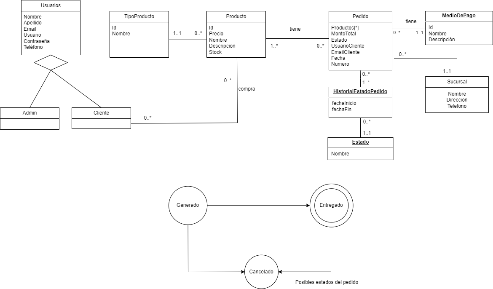

# Propuesta TP DSW

## Grupo
### Integrantes

* 47867 - Martínez Gaspar Andrés
* 51330 - Bidart Salomon Franco Hector Pablo

### Repositorios
* [Repositorio FRONTEND](https://github.com/francobidart/dsw-tp-frontend)
* [Repositorio BACKEND](https://github.com/francobidart/dsw-tp-backend)

## Tema
### Descripción

Desarrollaremos una plataforma de e-commerce acotada, que permitirá realizar la venta de artículos de informática. 
Contemplará el flujo de compra completo, así como la registración de artículos y pedidos. Contará con una gestión de usuarios, que
tendrán diferentes tipos de acceso de acuerdo al nivel asociado a ellos.

### Modelo

Link: [Modelo](https://drive.google.com/file/d/1pel8NPW2CEdsYUWWS26cUfVe_WRnkMDX/view?usp=sharing)

## Alcance Funcional 

### Alcance Mínimo

*Nota*: el siguiente es un ejemplo para un grupo de 3 integrantes para un sistema de hotel. El 

Aprobación Directa:

|Req|Detalle|
|:-|:-|
|CRUD simple|1. CRUD Producto  2. CRUD Usuario 3. CRUD Medio de Pago 4. CRUD Estados 5. CRUD Sucursal 6. CRUD TipoProducto |
|CRUD dependiente|1. CRUD Producto {depende de} CRUD Tipo Producto. |
|Listado + detalle| 1. Listado de producto filtrado por tipo de producto y por precio, mostrando nombre y precio del producto.  2. Listado de pedido por usuario y por sucursal, mostrando numero de pedido, nombre de cliente, nombre de sucursal e importe del pedido.|
|CUU/Epic|1. Realizar pedido. 2. Marcar pedido como entregado.|

### Alcance Adicional Voluntario

*Nota*: El Alcance Adicional Voluntario es opcional, pero ayuda a que la funcionalidad del sistema esté completa y será considerado en la nota en función de su complejidad y esfuerzo.

|Req|Detalle|
|:-|:-|
|CUU/Epic|1. Cancelación de pedido.|
|Otros|1. Envío de confirmación de pedido. 2.Cambio de sucursal de pedido pendiente de entrega.|

