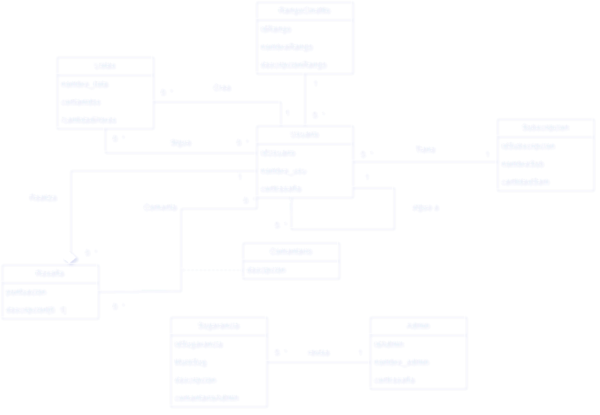

# Propuesta TP DSW

## Grupo
### Integrantes
* 50984-Aimaretti, Renzo
* 51848-Amelio Ortiz, Ignacio
* 50379-de Elia, Juan Manuel

### Repositorios
* Backend: (https://github.com/RenzoAimaretti/Backend)
* Frontend: (https://github.com/RenzoAimaretti/frontEndDWS)

## Tema
### Descripción
Decidimos crear una web app donde los usuarios puedan consultar información relevante sobre las películas y/o series que deseen. Podrán filtrar por: Título, año, director, actor y más. Además contará con listas que se actualizarán diariamente, dichas listas contendrán películas y/o series según temáticas tales como más vistas del mes, mejor puntuadas, ideales para ver en familia, etc. También los usuarios registrados podrán crear sus propias listas.

### Modelo

*Nota*: incluir un link con la imagen de un modelo, puede ser modelo de dominio, diagrama de clases, DER. Si lo prefieren pueden utilizar diagramas con [Mermaid](https://mermaid.js.org) en lugar de imágenes.

## Alcance Funcional 

### Alcance Mínimo

*Nota*: el siguiente es un ejemplo para un grupo de 3 integrantes para un sistema de hotel. El 

Regularidad:
|Req|Detalle|
|:-|:-|
|CRUD simple|1. CRUD Usuario 2. CRUD Tipos usuario 3. CRUD Rango de usuario|
|CRUD dependiente|1. CRUD Listas de usuario {depende de} CRUD Usuario 2. CRUD Reseña/Puntiacion {depende de} CRUD Usuario|
|Listado + detalle| 1. Listado peliculas creadas por los usuarios => detalle CRUD Usuario  2. Listado de usuarios registrados|
|CUU/Epic|1. Registrar un usuario 2. Registar una lista para un usuario|

Adicionales para Aprobación
|Req|Detalle|
|:-|:-|
|CRUD |1. CRUD Tipo Habitacion 2. CRUD Servicio 3. CRUD Localidad 4. CRUD Provincia 5. CRUD Habitación 6. CRUD Empleado 7. CRUD Cliente|
|CUU/Epic|1. Reservar una habitación para la estadía 2. Realizar el check-in de una reserva 3. Realizar el check-out y facturación de estadía y servicios|

### Alcance Adicional Voluntario

*Nota*: El Alcance Adicional Voluntario es opcional, pero ayuda a que la funcionalidad del sistema esté completa y será considerado en la nota en función de su complejidad y esfuerzo.

|Req|Detalle|
|:-|:-|
|Listados |1. Estadía del día filtrado por fecha muestra, cliente, habitaciones y estado  2. Reservas filtradas por cliente muestra datos del cliente y de cada reserve fechas, estado cantidad de habitaciones y huespedes|
|CUU/Epic|1. Consumir servicios 2. Cancelación de reserva|
|Otros|1. Envío de recordatorio de reserva por email|

