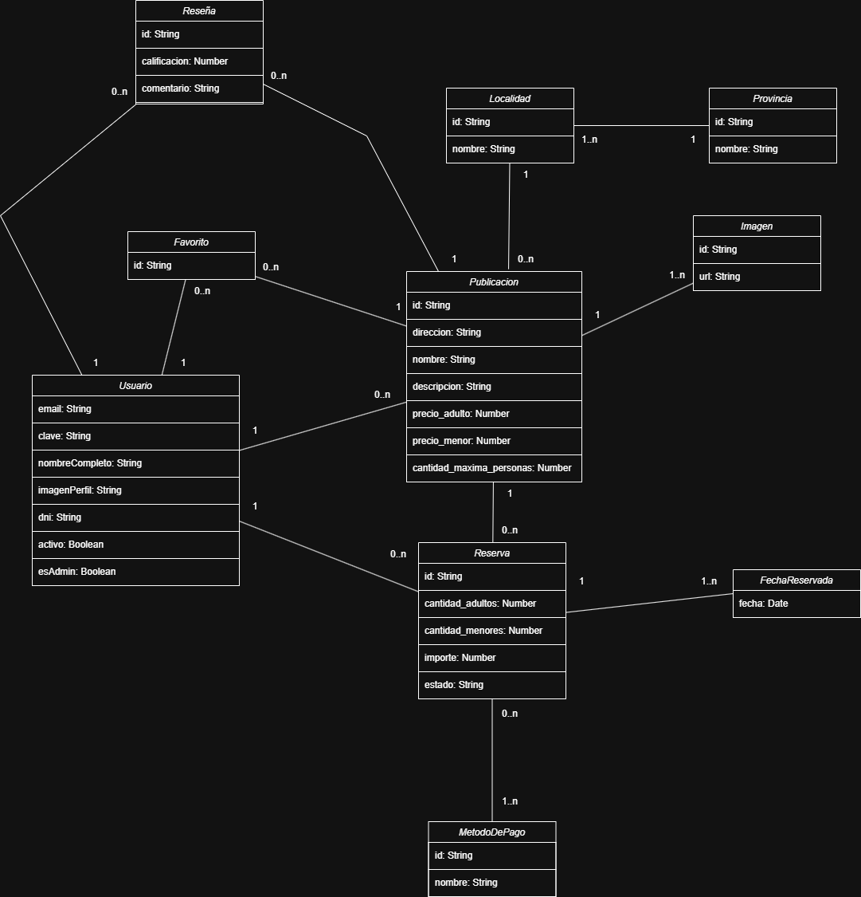

# Propuesta TP DSW

## Grupo

### Integrantes
- 41980 - Valenti, Sofía  
- 48318 - Merino, Federico  
- 49195 - Brassart, Selene

### Repositorios
- [Frontend App](https://github.com/fedemerino/dsw-frontend)  
- [Backend App](https://github.com/fedemerino/dsw-backend)  

---

## Tema

### Descripción

Aplicación web que permite a usuarios publicar alojamientos para alquiler temporario y a otros usuarios realizar reservas. Se podrán buscar alojamientos según fecha, localidad y cantidad de huéspedes, ver detalles de cada publicación, dejar reseñas, y gestionar reservas.

### Modelo

## Alcance Funcional

### Alcance Mínimo (Regularidad)

| Req              | Detalle |
|------------------|---------|
| CRUD simple      | 1. CRUD Usuarios 2. CRUD Provincias 3. CRUD Localidades  4. CRUD Métodos de Pago |
| CRUD dependiente | 1. CRUD Publicaciones (depende de Usuario, Localidad) 2. CRUD Imágenes (depende de Publicación) 3. CRUD Reservas (depende de Usuario y Publicación) 4. CRUD Reseñas (depende de Usuario y Publicación) |
| Listado + detalle| 1. Listado de publicaciones filtrado por localidad, fechas y cantidad de huéspedes 2. Detalle de cada publicación seleccionada |
| CUU / Epic       | 1. Registrar un usuario 2. Iniciar sesión 3. Realizar una publicación 4. Modificar o eliminar una publicación 5. Realizar una reserva |

---

### Alcance para Aprobación Directa

| Req     | Detalle |
|---------|---------|
| CRUDs   | CRUD completo de todas las entidades necesarias (Usuarios, Publicaciones, Reservas, Reseñas, Favoritos, Imágenes, Provincias, Localidades) |
| CUUs    | 1. Cancelar una reserva 2. Reseñar una publicación 3. Gestionar publicaciones propias 4. Agregar una publicación a favoritos 5. Bloquear un usuario |

---

### Alcance Adicional Voluntario

| Req     | Detalle |
|---------|---------|
| CUUs    | 1. Envío de recordatorio de reserva por email 2. Recuperar contraseña |
| Otros   | 1. Dashboard para anfitriones 2. Vista de reservas realizadas y próximas
