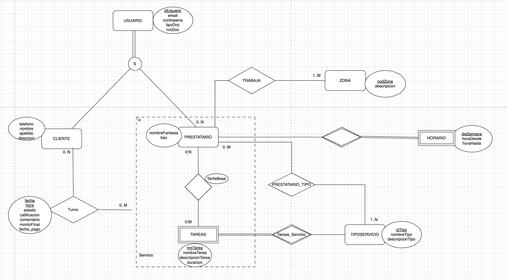

# Propuesta TP DSW

## Grupo

### Integrantes

- 52935 Agustín Dana
- 52933 Luis Parmigiani
- 52986 Juan Bautista Perez
- 52150 Santiago Malet

### Repositorios

- [fullstack app](https://github.com/Anfibio0010/tpDSW)

## Tema

### Descripción

La idea del Trabajo Practico es hacer una web que permite a la gente contratar servicios para su casa. Estos servicios podrían ser plomeria, gasista, pintor, cerrajero, etc....
Los prestatarios de los servicios van a poder registrarse en la página para indicar que servicios van a brindar.

### Modelo

## Alcance Funcional

### Alcance Mínimo

Regularidad:
|Req|Detalle|
|:-|:-|
|CRUD simple|1. CRUD Usuario  2. CRUD TipoServicio  3. CRUD Turno  4. CRUD Zona|
|CRUD dependiente|1.CRUD Horarios depende de Prestatario  2. CRUD Prestatario depende de Tipo de Servicios y de Horarios  
|Listado + detalle| 1. Listado de prestatario filtrado por tipo de servicios, tarifa, puntuacion y horarios   2. Historial de reservas realizadas para volver a contactar a algun prestatario|
|CUU/Epic|1. Realizar reserva de un servicio con un prestatario   2. Realizar una reseña de una reserva con un Prestatario|
Adicionales para Aprobación
|Req|Detalle|
|:-|:-|
|CRUD simple|1. CRUD Usuario  2. CRUD TipoServicio  3. CRUD Turno  4.CRUD Zona   5. CRUD Servicio |
|CRUD dependiente|1. CRUD Agenda depende Turno y Horarios  2. CRUD Prestatario depende de Tipo de Servicios   3. CRUD Turno depende Servicio   4. CRUD Reseña depende de Turno   5. CRUD Tarea depende de TipoServicio   6. CRUD Horario depende de Prestatario
|Listado + detalle| 1. Listado de prestatario filtrado por tipo de servicios, tarifa, puntuacion y horarios   2. Historial de reservas realizadas para volver a contactar a algun prestatario|
|CUU/Epic|1. Mandar mail de recordatorio de reserva tanto al prestatario como al que lo contrata  2. Implementar pagos online (stripe o mercado pago)   3. Implementar moderación de resenas por IA.|

### Alcance Adicional Voluntario

| Req      | Detalle                                                                                                                                                                        |
| :------- | :----------------------------------------------------------------------------------------------------------------------------------------------------------------------------- |
| Listados | 1. Mostrar datos de los prestatarios mejores evaluados                                                                                                                      |
| CUU/Epic | 1. Cancelar reserva realizada                                                                                                                                               |
| Otros    | 1. Envío de recordatorio de reserva por email  2.Implementar planes de suscripción para los prestatarios.  3.Guiar al Prestatario via google maps hacia su destino.   |
