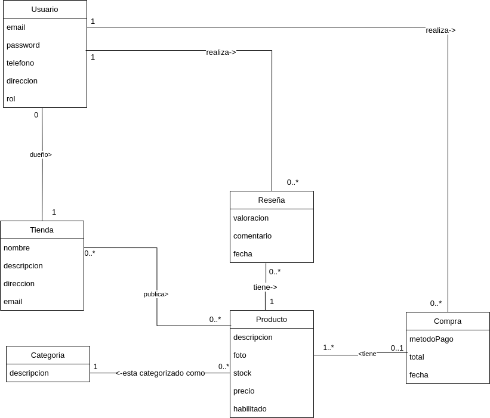

# Propuesta TP DSW

## Grupo
### Integrantes
| Legajo | Apellido(s), Nombre(s)|
|:-|:-|
|45997|Biscaldi, Ivan|
|47087|Sandoval, Julian|

### Repositorios
* [frontend app](https://github.com/Biscaldi-Iv/DSWFrontEnd)
* [backend app](https://github.com/Biscaldi-Iv/TP-DSW)
*Nota*: si utiliza un monorepo indicar un solo link con fullstack app.

## Tema
### Descripción
*2 a 6 líneas describiendo el negocio (menos es más)*

Implementar un sistema de e-commerce que permita a los usuarios comprar y vender productos o servicios a través de internet. Este sistema debe incluir estas funcionalidades

Catálogo de productos: una lista de los productos y servicios disponibles para comprar, con información detallada de cada uno de ellos, como nombre, descripción, precio, imágenes, entre otros.

Carrito de compras: una funcionalidad que permite al usuario seleccionar los productos que desea comprar y guardarlos temporalmente en su carrito, para luego procesar el pago de todos ellos al mismo tiempo.

Proceso de pago: una serie de pasos que el usuario debe seguir para pagar los productos que ha seleccionado. Este proceso suele incluir la selección de la forma de pago y la introducción de los datos de facturación y envío.

Gestión de pedidos: una sección en la que el usuario puede ver el estado de sus pedidos, y solicitar cambios o devoluciones.

Gestión de inventario: una herramienta que permite al vendedor gestionar su inventario de productos, ver las ventas realizadas y actualizar la disponibilidad de los productos.

Gestión de usuarios: una sección en la que el usuario puede crear y gestionar su cuenta, y el vendedor puede gestionar su información personal, como dirección de facturación y envío.

Reseña de productos: permite a los usuarios puntuar y comentar la calidad del producto y del vendedor.

### Modelo

*Nota*: incluir un link con la imagen de un modelo, puede ser modelo de dominio, diagrama de clases, DER. Si lo prefieren pueden utilizar diagramas con [Mermaid](https://mermaid.js.org) en lugar de imágenes.

## Alcance Funcional 

### Alcance Mínimo

*Nota*: el siguiente es un ejemplo para un grupo de 3 integrantes para un sistema de hotel. El 

Regularidad:
|Req|Detalle|
|:-|:-|
|CRUD simple|1. CRUD Usuario  2. CRUD Vendedor|
|CRUD dependiente|1. CRUD Producto {depende de} CRUD Categoria 2. CRUD Review {depende de} CRUD Producto  |
|Listado + detalle| 1. Listado de productos filtrado por categoria y ordenado por precio => detalle muestra datos del producto, promedio de reseñas  2. Listado de Usuario filtrado por rol => CRUD usuarios  3. Estado de inventario: muestra lista de productos del usuario=> detalle CRUD productos |
|CUU/Epic|1. Realizar una compra de producto 2. Publicar un producto|

Adicionales para Aprobación
|Req|Detalle|
|:-|:-|
|CRUD |1. CRUD Producto 2. CRUD Categoria de producto 3. CRUD Usuario 4. CRUD Vendedor 5. CRUD Compras 5. CRUD Reseñas|
|Listado + detalle| 1. Listado de productos filtrado por categoria y ordenado por precio => detalle muestra datos del producto, promedio de reseñas  2. Listado de Usuario filtrado por rol => CRUD usuarios  3. Estado de inventario: muestra lista de productos del usuario=> detalle CRUD productos  4. Listado de ventas: muestra productos y estado de los pedidos |
|CUU/Epic|1. Realizar una compra de productos 2. Publicar un producto 3. Realizar reseña de producto|

### Alcance Adicional Voluntario

*Nota*: El Alcance Adicional Voluntario es opcional, pero ayuda a que la funcionalidad del sistema esté completa y será considerado en la nota en función de su complejidad y esfuerzo.

|Req|Detalle|
|:-|:-|
|Listados |1.  2. |
|CUU/Epic|1. Devolucion de una compra |
|Otros|1. Envío de recibo de compra por mail|

