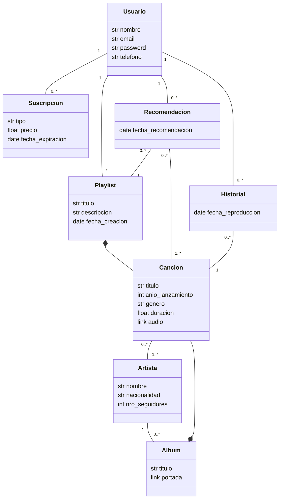

# Propuesta TP DSW

## Grupo
### Integrantes
* 47999 - Paolini, Alessandro
* 47844 - Vivas, Facundo Ignacio
* 47800 - Guerra, Bautista

### Repositorios
* [fullstack app](https://github.com/AlessandroPaolini7/TTADS-2023.git)

## Aplicación de streaming de música
### Descripción
El negocio de esta aplicación de streaming de música se centra en ofrecer a los usuarios una plataforma para descubrir, reproducir y gestionar música de forma conveniente y personalizada. La aplicación permite a los usuarios registrarse y acceder a una amplia biblioteca de canciones de diversos géneros y artistas. Los usuarios pueden crear y administrar listas de reproducción personalizadas, así como explorar recomendaciones basadas en su historial de escucha.

### Modelo

## Alcance Funcional 
|Req|Detalle|
|:-|:-|
|CRUD |1. CRUD Usuario 2. CRUD Playlist 3. CRUD Suscripcion 4. CRUD Cancion 5. CRUD Artista 6. CRUD Album |
|CUU|1. Crear una nueva playlist 2. Realizar la busqueda de una canción para escuchar 3. Agregar una canción a playlist existente 4. Suscribirse al servicio 5. Realizar la mejora de suscripción 6. Crear una cuenta de usuario 7. Realizar busqueda de canciones por género 8. Descargar una lista de reproducción para escuchar sin conexión|

--

### Regularidad:
|Req|Detalle|
|:-|:-|
|CRUD simple|1. CRUD Usuario 2. CRUD Artista |
|CRUD dependiente|1. CRUD Playlist 2. CRUD Suscripcion 3. CRUD Cancion 4. CRUD Album |
|Listado + detalle| 1. Listado de Canciones filtradas por título, género y artista => detalle completo de la canción  2. Listado de playlists filtradas por aquellas creadas por el ususario => detalle completo de la playlist + detalle canciones|
|CUU/Epic|1. Crear una nueva playlist 2. Agregar una canción a playlist existente|

### Aprobación:
|Req|Detalle|
|:-|:-|
|CRUD |1. CRUD Usuario 2. CRUD Playlist 3. CRUD Suscripcion 4. CRUD Cancion 5. CRUD Artista 6. CRUD Album 7. CRUD Historial 8. CRUD Recomendacion|
|CUU/Epic|1. Suscribirse al servicio 2. Descargar una lista de reproducción para escuchar sin conexión 3. Realizar la mejora de suscripción|

### Alcance Adicional Voluntario:
|Req|Detalle|
|:-|:-|
|Listados | Listado de la cola de reproducción determinada por el usuario |
|CUU/Epic|1. Agregar canción a cola de reproducción  2. Cancelar suscripción|
|Otros|1. Envío de notifiaciones (mail) para confirmación de suscripción / modificación de suscripción|
